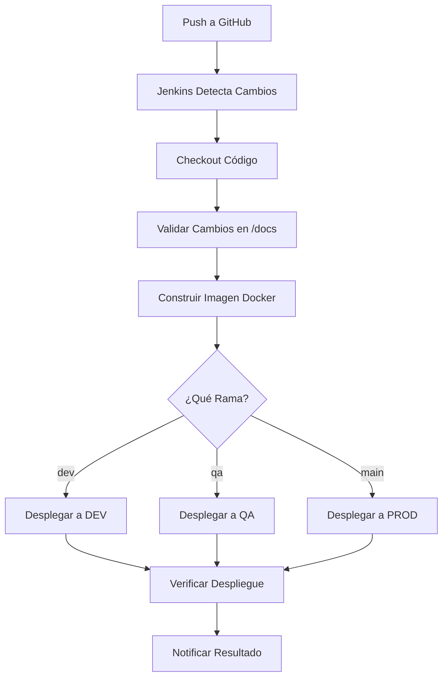

# 🚀 Jenkins CI/CD para OptiCash Documentation

Este documento explica cómo configurar y usar el pipeline de Jenkins para el despliegue automático de la documentación de OptiCash.

## 📋 Tabla de Contenidos

- [Configuración Inicial](#configuración-inicial)
- [Estructura del Pipeline](#estructura-del-pipeline)
- [Configuración de Jenkins](#configuración-de-jenkins)
- [Uso del Pipeline](#uso-del-pipeline)
- [Troubleshooting](#troubleshooting)
- [Escalabilidad](#escalabilidad)

## 🔧 Configuración Inicial

### Prerrequisitos

1. **Jenkins** instalado y configurado
2. **Docker** instalado en el servidor Jenkins
3. **Git** configurado
4. **Repositorio GitHub** con acceso

### Plugins de Jenkins Requeridos

- Pipeline Plugin
- GitHub Plugin
- Docker Pipeline Plugin
- Email Extension Plugin
- Build Timeout Plugin

## 🏗️ Estructura del Pipeline

### Archivos del Pipeline

```
opticash_v2/
├── Jenkinsfile                 # Pipeline principal
├── Dockerfile.docs            # Imagen Docker para documentación
├── docker-compose.yml         # Orquestación de contenedores
├── .dockerignore             # Archivos a ignorar en Docker
├── scripts/
│   ├── deploy.sh             # Script de despliegue
│   └── test-deployment.ps1   # Script de pruebas (Windows)
└── README-Jenkins.md         # Esta documentación
```

### Flujo del Pipeline



## ⚙️ Configuración de Jenkins

### 1. Crear Job de Pipeline

1. **Nuevo Item** → **Pipeline**
2. **Nombre**: `opticash-docs-pipeline`
3. **Configuración**:
   - **Pipeline script from SCM**
   - **SCM**: Git
   - **Repository URL**: `https://github.com/tu-usuario/opticash_v2.git`
   - **Branch**: `*/dev` (para desarrollo)
   - **Script Path**: `Jenkinsfile`

### 2. Configurar Credenciales

#### Credenciales SSH (si es necesario)
1. **Manage Jenkins** → **Manage Credentials**
2. **Add Credentials** → **SSH Username with private key**
3. **ID**: `opticash-ssh-credentials`
4. **Username**: `deploy`
5. **Private Key**: Contenido de tu clave SSH privada

#### Credenciales de Docker Registry (opcional)
1. **Add Credentials** → **Username with password**
2. **ID**: `docker-registry-credentials`
3. **Username**: Tu usuario del registry
4. **Password**: Tu contraseña del registry

### 3. Configurar Webhooks de GitHub

1. En tu repositorio GitHub:
   - **Settings** → **Webhooks** → **Add webhook**
   - **Payload URL**: `http://tu-jenkins.com/github-webhook/`
   - **Content type**: `application/json`
   - **Events**: `Push events` y `Pull request events`

### 4. Variables de Entorno

En la configuración del job, agregar variables de entorno:

```bash
# Servidores de despliegue
DEV_SERVER=dev.opticash.com
QA_SERVER=qa.opticash.com
PROD_SERVER=prod.opticash.com

# Docker Registry
DOCKER_REGISTRY=registry.opticash.com

# Credenciales
SSH_CREDENTIALS=opticash-ssh-credentials
```

## 🚀 Uso del Pipeline

### Despliegue Automático

El pipeline se ejecuta automáticamente cuando:

- **Push a `dev`** → Despliega en ambiente DEV
- **Merge a `qa`** → Despliega en ambiente QA  
- **Merge a `main`** → Despliega en ambiente PRODUCCIÓN

### Despliegue Manual

1. **Build with Parameters** en Jenkins
2. Seleccionar:
   - **DEPLOY_ENVIRONMENT**: dev/qa/prod
   - **FORCE_DEPLOY**: true/false
   - **CUSTOM_TAG**: tag personalizado (opcional)

### Verificar Despliegue

#### Usando Scripts

```bash
# Linux/Mac
./scripts/deploy.sh dev
./scripts/deploy.sh qa
./scripts/deploy.sh prod

# Windows
.\scripts\test-deployment.ps1 dev
.\scripts\test-deployment.ps1 qa
.\scripts\test-deployment.ps1 prod
```

#### URLs de Verificación

- **DEV**: http://localhost:8080
- **QA**: http://localhost:8081
- **PROD**: http://localhost

## 🔍 Troubleshooting

### Problemas Comunes

#### 1. Pipeline no se ejecuta
- ✅ Verificar webhook de GitHub
- ✅ Verificar permisos del repositorio
- ✅ Verificar configuración de SCM

#### 2. Error de Docker
- ✅ Verificar que Docker está instalado
- ✅ Verificar permisos de Docker
- ✅ Verificar espacio en disco

#### 3. Error de despliegue
- ✅ Verificar credenciales SSH
- ✅ Verificar conectividad con servidores
- ✅ Verificar puertos disponibles

#### 4. Documentación no se actualiza
- ✅ Verificar que hay cambios en `/docs`
- ✅ Verificar que el contenedor se reinició
- ✅ Verificar logs del contenedor

### Logs y Debugging

```bash
# Ver logs del pipeline
docker logs opticash-docs-dev
docker logs opticash-docs-qa
docker logs opticash-docs-prod

# Ver estado de contenedores
docker ps -f name=opticash-docs

# Ver logs de Jenkins
tail -f /var/log/jenkins/jenkins.log
```

## 📈 Escalabilidad

### Para Futuras Funcionalidades

El pipeline está diseñado para ser escalable:

#### 1. Agregar Backend
```groovy
// En Jenkinsfile, agregar etapa:
stage('Build Backend') {
    steps {
        // Construir API de OptiCash
        sh 'docker build -f Dockerfile.api -t opticash-api .'
    }
}
```

#### 2. Agregar Frontend
```groovy
// En Jenkinsfile, agregar etapa:
stage('Build Frontend') {
    steps {
        // Construir aplicación React/Vue
        sh 'docker build -f Dockerfile.frontend -t opticash-frontend .'
    }
}
```

#### 3. Agregar Tests
```groovy
// En Jenkinsfile, agregar etapa:
stage('Run Tests') {
    steps {
        // Ejecutar tests unitarios e integración
        sh 'npm test'
        sh 'npm run test:e2e'
    }
}
```

#### 4. Agregar Notificaciones
```groovy
// En Jenkinsfile, agregar:
post {
    always {
        // Notificar a Slack, Teams, etc.
        slackSend channel: '#opticash', message: "Build ${env.BUILD_NUMBER} completed"
    }
}
```

### Configuración Avanzada

#### 1. Múltiples Ambientes
```groovy
// Agregar más ambientes
environment {
    STAGING_SERVER = 'staging.opticash.com'
    PREPROD_SERVER = 'preprod.opticash.com'
}
```

#### 2. Blue-Green Deployment
```groovy
// Implementar blue-green deployment
stage('Blue-Green Deploy') {
    steps {
        // Lógica de blue-green deployment
    }
}
```

#### 3. Rollback Automático
```groovy
// Agregar rollback automático
post {
    failure {
        // Rollback automático en caso de fallo
    }
}
```

## 📞 Soporte

Para soporte técnico:

- **Email**: team@opticash.com
- **Slack**: #opticash-dev
- **Documentación**: [docs.opticash.com](http://docs.opticash.com)

## 📝 Changelog

### v1.0.0 (2024-09-30)
- ✅ Pipeline inicial para documentación
- ✅ Soporte para 3 ambientes (dev, qa, prod)
- ✅ Despliegue con Docker y Nginx
- ✅ Scripts de despliegue y pruebas
- ✅ Documentación completa

---

**¡El pipeline está listo para usar! 🎉**
