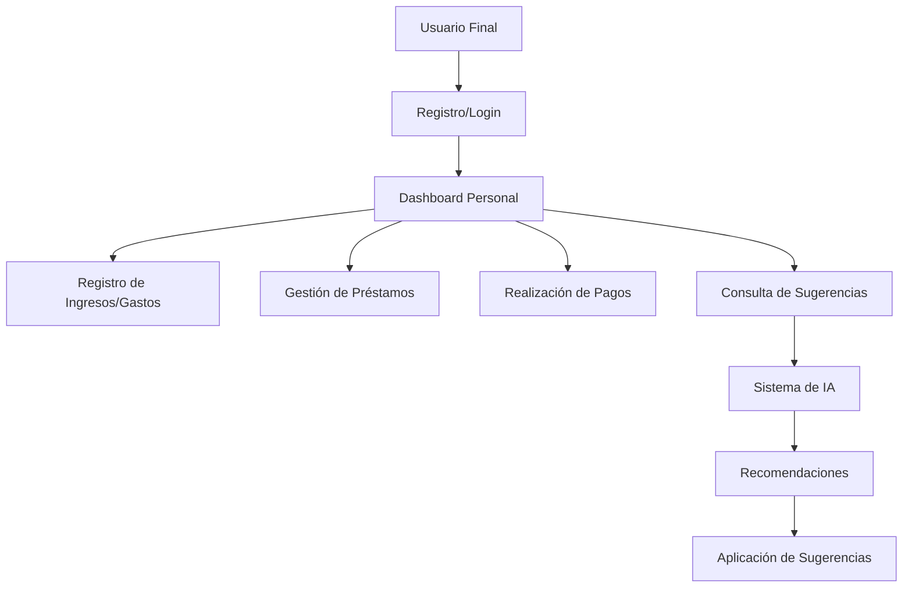
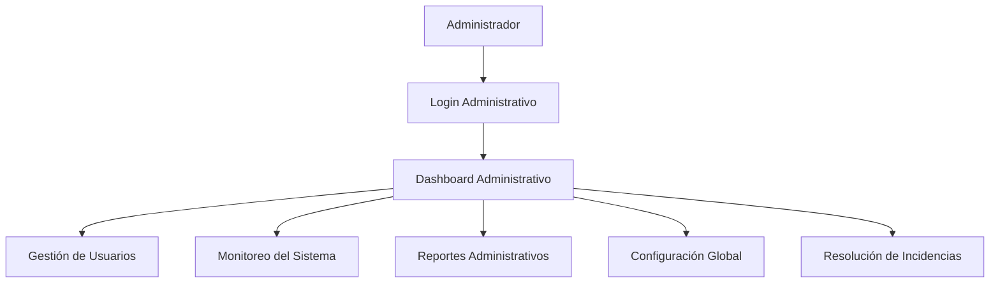
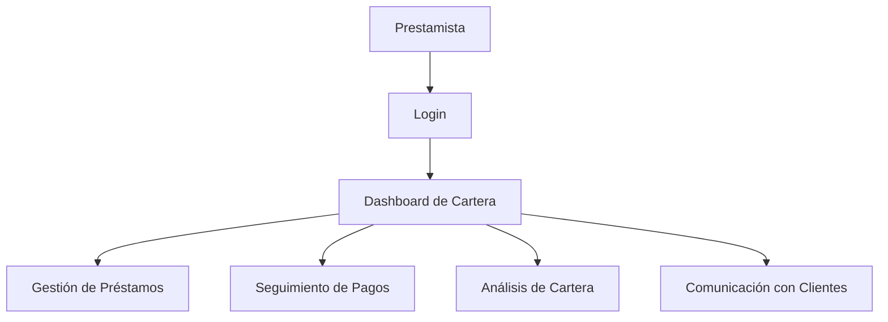

# OptiCash - Actores del Sistema

## 📋 Resumen

Este documento define todos los actores que interactúan con el sistema OptiCash, un gestor financiero personal inteligente. Se identifican los roles, responsabilidades y permisos de cada actor.

## 👥 Actores Principales

### 1. USUARIO FINAL (Prestatario)
**Descripción:** Persona que utiliza OptiCash para gestionar sus finanzas personales, incluyendo préstamos, gastos e ingresos.

**Características:**
- Usuario individual
- Gestiona sus propias finanzas personales
- Busca optimizar sus pagos de préstamos
- Necesita sugerencias inteligentes para abonos a capital
- Requiere historial detallado de movimientos financieros

**Funcionalidades Principales:**
- **Gestión de Perfil:**
  - Registro y autenticación
  - Actualización de datos personales
  - Configuración de preferencias
  - Gestión de contraseñas

- **Gestión Financiera:**
  - Registro de ingresos con categorización
  - Registro de gastos con categorización
  - Visualización de historial financiero
  - Análisis de patrones de gasto

- **Gestión de Préstamos:**
  - Registro de préstamos personales
  - Visualización de préstamos activos
  - Seguimiento de cuotas pendientes
  - Consulta de saldos y vencimientos

- **Sistema de Pagos:**
  - Realización de pagos de cuotas
  - Aplicación de abonos a capital
  - Consulta de historial de pagos
  - Generación de comprobantes

- **Sugerencias Inteligentes:**
  - Consulta de sugerencias de abono
  - Análisis de liquidez disponible
  - Proyecciones de pago acelerado
  - Recomendaciones personalizadas

**Permisos:**
- ✅ Acceso completo a sus propios datos
- ✅ Crear y modificar sus registros financieros
- ✅ Realizar pagos de sus préstamos
- ✅ Consultar sugerencias inteligentes
- ✅ Exportar sus datos personales
- ❌ Acceso a datos de otros usuarios
- ❌ Funciones administrativas del sistema

---

### 2. PRESTAMISTA
**Descripción:** Persona o entidad que otorga préstamos y utiliza OptiCash para gestionar su cartera de préstamos.

**Características:**
- Puede ser individual o institucional
- Gestiona múltiples préstamos
- Necesita seguimiento de pagos
- Requiere reportes de rendimiento de cartera
- Busca optimizar la recuperación de préstamos

**Funcionalidades Principales:**
- **Gestión de Préstamos:**
  - Registro de préstamos otorgados
  - Configuración de términos y condiciones
  - Seguimiento de estado de préstamos
  - Cálculo de intereses y comisiones

- **Seguimiento de Pagos:**
  - Visualización de pagos recibidos
  - Seguimiento de cuotas vencidas
  - Aplicación de pagos a cuotas
  - Gestión de morosidad

- **Análisis de Cartera:**
  - Dashboard de préstamos activos
  - Análisis de rendimiento
  - Reportes de recuperación
  - Proyecciones de ingresos

- **Gestión de Clientes:**
  - Visualización de información de prestatarios
  - Historial de préstamos por cliente
  - Comunicación con prestatarios
  - Evaluación de riesgo crediticio

**Permisos:**
- ✅ Acceso a préstamos otorgados
- ✅ Visualización de pagos recibidos
- ✅ Generación de reportes de cartera
- ✅ Gestión de términos de préstamos
- ✅ Comunicación con prestatarios
- ❌ Acceso a datos personales no relacionados con préstamos
- ❌ Modificación de datos de otros prestamistas

---

### 3. ADMINISTRADOR DEL SISTEMA
**Descripción:** Usuario con privilegios administrativos para gestionar el sistema OptiCash completo.

**Características:**
- Acceso completo al sistema
- Responsable de la configuración global
- Gestiona usuarios y permisos
- Monitorea el rendimiento del sistema
- Resuelve problemas técnicos

**Funcionalidades Principales:**
- **Gestión de Usuarios:**
  - Creación y gestión de cuentas de usuario
  - Asignación de roles y permisos
  - Gestión de sesiones activas
  - Reseteo de contraseñas

- **Configuración del Sistema:**
  - Parámetros globales de la aplicación
  - Configuración de algoritmos de sugerencias
  - Gestión de categorías financieras
  - Configuración de notificaciones

- **Monitoreo y Auditoría:**
  - Monitoreo de transacciones del sistema
  - Logs de actividad de usuarios
  - Auditoría de seguridad
  - Métricas de rendimiento

- **Gestión de Datos:**
  - Respaldo y recuperación de datos
  - Migración de datos
  - Limpieza de datos obsoletos
  - Exportación de datos del sistema

- **Soporte Técnico:**
  - Resolución de incidencias
  - Atención a consultas de usuarios
  - Mantenimiento del sistema
  - Actualizaciones y parches

**Permisos:**
- ✅ Acceso completo a todos los datos del sistema
- ✅ Gestión de usuarios y roles
- ✅ Configuración global del sistema
- ✅ Monitoreo y auditoría
- ✅ Resolución de incidencias
- ✅ Acceso a logs y métricas
- ✅ Gestión de respaldos

---

### 4. ANALISTA FINANCIERO
**Descripción:** Usuario especializado en análisis financiero y generación de reportes avanzados para el sistema.

**Características:**
- Conocimientos financieros avanzados
- Acceso a datos agregados y anónimos
- Genera reportes especializados
- Analiza tendencias del mercado
- Proporciona insights estratégicos

**Funcionalidades Principales:**
- **Análisis de Datos:**
  - Análisis de tendencias financieras
  - Identificación de patrones de comportamiento
  - Análisis de riesgo de cartera
  - Proyecciones financieras

- **Generación de Reportes:**
  - Reportes de uso del sistema
  - Análisis de efectividad de sugerencias
  - Reportes de satisfacción de usuarios
  - Métricas de adopción de funcionalidades

- **Optimización de Algoritmos:**
  - Análisis de precisión de sugerencias
  - Identificación de mejoras en algoritmos
  - Testing de nuevas funcionalidades
  - Validación de modelos financieros

- **Investigación y Desarrollo:**
  - Análisis de nuevas funcionalidades
  - Estudios de mercado
  - Benchmarking con competidores
  - Propuestas de mejoras

**Permisos:**
- ✅ Acceso a datos agregados y anónimos
- ✅ Generación de reportes avanzados
- ✅ Análisis de tendencias
- ✅ Acceso a métricas del sistema
- ❌ Acceso a datos personales individuales
- ❌ Modificación de datos del sistema
- ❌ Gestión de usuarios

---

## 🤖 Actores Secundarios (Sistemas Externos)

### 5. SISTEMA DE PAGOS
**Descripción:** Servicio externo para procesamiento de pagos electrónicos.

**Características:**
- Integración con múltiples gateways de pago
- Procesamiento seguro de transacciones
- Validación de métodos de pago
- Confirmación de pagos en tiempo real

**Funcionalidades:**
- **Procesamiento de Pagos:**
  - Validación de tarjetas de crédito/débito
  - Procesamiento de transferencias bancarias
  - Validación de métodos de pago alternativos
  - Confirmación de transacciones

- **Gestión de Transacciones:**
  - Reversión de pagos
  - Reembolsos
  - Conciliación de transacciones
  - Reportes de transacciones

**Integración:**
- APIs REST para procesamiento
- Webhooks para notificaciones
- Encriptación de datos sensibles
- Cumplimiento PCI DSS

---

### 6. SISTEMA DE NOTIFICACIONES
**Descripción:** Servicio para envío de notificaciones a usuarios del sistema.

**Características:**
- Múltiples canales de comunicación
- Personalización de mensajes
- Programación de notificaciones
- Seguimiento de entrega

**Funcionalidades:**
- **Notificaciones por Email:**
  - Confirmaciones de pago
  - Recordatorios de vencimiento
  - Alertas de sistema
  - Reportes periódicos

- **Notificaciones Push:**
  - Alertas en tiempo real
  - Sugerencias de abono
  - Recordatorios de tareas
  - Actualizaciones de estado

- **Notificaciones SMS:**
  - Alertas críticas
  - Códigos de verificación
  - Recordatorios urgentes
  - Confirmaciones importantes

**Integración:**
- APIs para envío de notificaciones
- Templates personalizables
- Programación de envíos
- Métricas de entrega

---

### 7. SISTEMA DE ANALYTICS
**Descripción:** Servicio para análisis de datos y métricas del sistema OptiCash.

**Características:**
- Recopilación de métricas en tiempo real
- Análisis de comportamiento de usuarios
- Reportes de uso del sistema
- Dashboards interactivos

**Funcionalidades:**
- **Tracking de Eventos:**
  - Eventos de usuario
  - Transacciones financieras
  - Uso de funcionalidades
  - Errores del sistema

- **Análisis de Rendimiento:**
  - Métricas de respuesta
  - Uso de recursos
  - Disponibilidad del sistema
  - Errores y excepciones

- **Análisis de Negocio:**
  - Adopción de funcionalidades
  - Satisfacción de usuarios
  - Retención de usuarios
  - Conversión de funcionalidades

**Integración:**
- APIs para envío de eventos
- Dashboards en tiempo real
- Reportes automatizados
- Alertas de métricas

---

## 📊 Matriz de Roles y Permisos

| Funcionalidad | Usuario Final | Prestamista | Administrador | Analista |
|---------------|---------------|-------------|---------------|----------|
| **Gestión de Perfil** | ✅ | ✅ | ✅ | ✅ |
| **Registro de Ingresos** | ✅ | ❌ | ✅ | ❌ |
| **Registro de Gastos** | ✅ | ❌ | ✅ | ❌ |
| **Gestión de Préstamos** | ✅ (propios) | ✅ (otorgados) | ✅ | ❌ |
| **Realización de Pagos** | ✅ | ❌ | ✅ | ❌ |
| **Sugerencias Inteligentes** | ✅ | ❌ | ✅ | ❌ |
| **Reportes Personales** | ✅ | ✅ | ✅ | ❌ |
| **Reportes de Cartera** | ❌ | ✅ | ✅ | ❌ |
| **Reportes Administrativos** | ❌ | ❌ | ✅ | ✅ |
| **Gestión de Usuarios** | ❌ | ❌ | ✅ | ❌ |
| **Configuración del Sistema** | ❌ | ❌ | ✅ | ❌ |
| **Análisis de Datos** | ❌ | ❌ | ✅ | ✅ |
| **Monitoreo del Sistema** | ❌ | ❌ | ✅ | ✅ |

## 🔄 Flujos de Interacción

### Flujo Principal: Usuario Final

### Flujo Administrativo

### Flujo de Prestamista

## 📋 Criterios de Aceptación

### ✅ Completados:
- [x] Identificación de actores principales
- [x] Definición de roles y responsabilidades
- [x] Especificación de permisos por actor
- [x] Matriz de roles y permisos
- [x] Flujos de interacción
- [x] Documentación de actores secundarios
- [x] Integración con sistemas externos

### 📝 Entregables:
- **Documento de Actores:** `docs/actors.md`
- **Matriz de Permisos:** Tabla de roles y funcionalidades
- **Diagramas de Flujo:** Interacciones entre actores
- **Especificaciones de Roles:** Detalles de cada actor

## 🎯 Consideraciones Especiales

### Seguridad por Actor
- **Usuario Final:** Acceso solo a sus datos personales
- **Prestamista:** Acceso a préstamos otorgados únicamente
- **Administrador:** Acceso completo con auditoría
- **Analista:** Acceso a datos agregados y anónimos

### Escalabilidad
- Cada actor puede escalar independientemente
- Roles pueden ser asignados dinámicamente
- Permisos granulares por funcionalidad
- Auditoría completa de accesos

### Integración
- APIs bien definidas para cada actor
- Autenticación y autorización robusta
- Logs de auditoría por actor
- Monitoreo de actividad por rol

---

**Actores del Sistema OptiCash** - Versión 1.0
