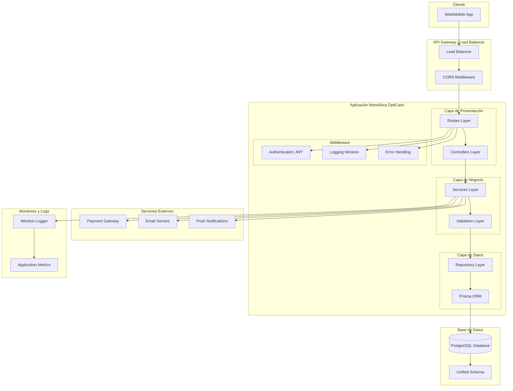
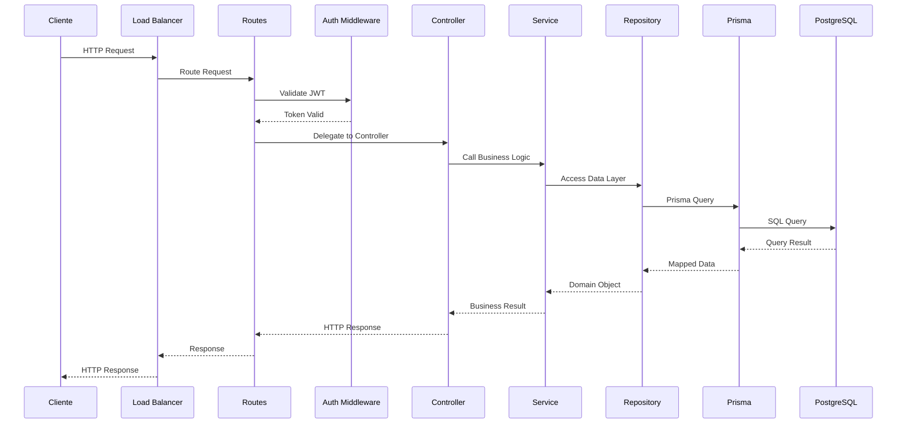
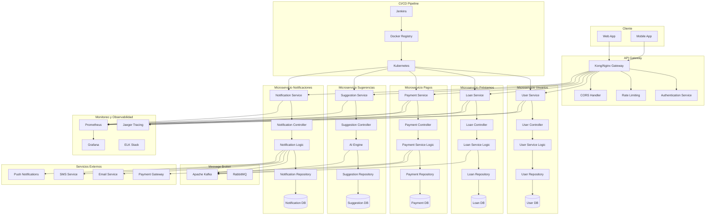
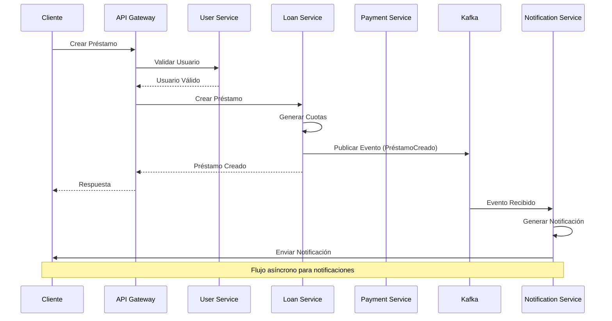
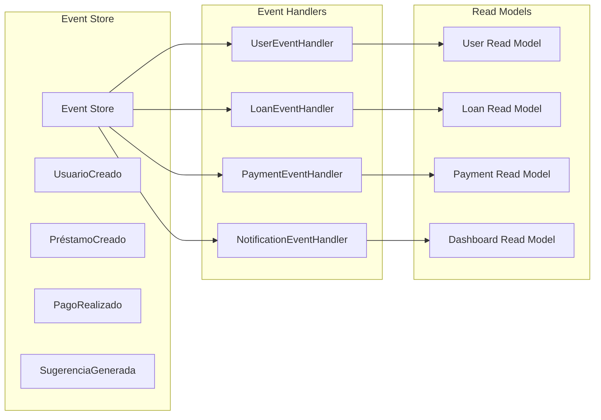

# OptiCash - Arquitectura del Sistema

## 📋 Resumen

Este documento describe la arquitectura actual y la evolución planificada del sistema OptiCash, un gestor financiero personal inteligente que ayuda a los usuarios a organizar de forma inteligente sus préstamos, gastos e ingresos.

## 🎯 Objetivos Arquitectónicos

### Principios de Diseño
1. **Escalabilidad:** Capacidad de crecer con la demanda
2. **Mantenibilidad:** Código limpio y bien estructurado
3. **Disponibilidad:** 99.95% uptime garantizado
4. **Seguridad:** Protección robusta de datos financieros
5. **Flexibilidad:** Adaptación a cambios de requisitos
6. **Evolutividad:** Migración gradual a microservicios

### Patrones Arquitectónicos
- **MVC (Model-View-Controller):** Separación de responsabilidades
- **Repository Pattern:** Abstracción de acceso a datos
- **Service Layer:** Lógica de negocio encapsulada
- **Middleware Pattern:** Procesamiento de requests
- **Event Sourcing:** Para futura evolución a microservicios

## 🏗️ Arquitectura Actual (Monolítica)

### Stack Tecnológico Actual
- **Runtime:** Node.js 18+
- **Framework:** Express.js 4.x
- **ORM:** Prisma 5.x
- **Base de Datos:** PostgreSQL 15+
- **Autenticación:** JWT (jsonwebtoken)
- **Validación:** Express Validator
- **Logging:** Winston
- **Testing:** Jest + Supertest
- **Versionamiento:** Git + GitFlow

### Características de la Arquitectura Actual
- **Monolítica:** Todos los componentes en una sola aplicación
- **Modular:** Estructura organizada por capas y dominios
- **Escalable:** Preparada para evolución a microservicios
- **Segura:** Autenticación JWT y validación robusta
- **Mantenible:** Código limpio y bien documentado

### Estructura de Directorios Actual
```
opticash_v2/
├── src/
│   ├── controllers/          # Controladores de la API
│   │   ├── userController.js
│   │   ├── loanController.js
│   │   ├── paymentController.js
│   │   └── suggestionController.js
│   ├── services/             # Lógica de negocio
│   │   ├── userService.js
│   │   ├── loanService.js
│   │   ├── paymentService.js
│   │   └── suggestionService.js
│   ├── routes/               # Definición de rutas
│   │   ├── auth.js
│   │   ├── users.js
│   │   ├── loans.js
│   │   └── payments.js
│   ├── middleware/           # Middleware personalizado
│   │   ├── auth.js
│   │   ├── validation.js
│   │   ├── errorHandler.js
│   │   └── logging.js
│   ├── config/               # Configuraciones
│   │   ├── database.js
│   │   └── jwt.js
│   ├── utils/                # Utilidades
│   │   ├── helpers.js
│   │   └── constants.js
│   └── index.js              # Punto de entrada
├── prisma/
│   ├── schema.prisma         # Esquema de base de datos
│   └── migrations/           # Migraciones de BD
├── tests/                    # Pruebas unitarias e integración
├── docs/                     # Documentación del proyecto
├── package.json
└── .env                      # Variables de entorno
```

### Diagrama de Arquitectura Actual



### Flujo de Datos Actual



## 🏛️ Patrones de Diseño Implementados

### 1. Patrón MVC (Model-View-Controller)
```javascript
// Ejemplo de implementación
class UserController {
  async createUser(req, res) {
    try {
      const userData = req.body;
      const user = await userService.createUser(userData);
      res.status(201).json({ success: true, data: user });
    } catch (error) {
      res.status(400).json({ success: false, message: error.message });
    }
  }
}

class UserService {
  async createUser(userData) {
    // Lógica de negocio
    const hashedPassword = await bcrypt.hash(userData.password, 10);
    return await userRepository.create({ ...userData, password: hashedPassword });
  }
}

class UserRepository {
  async create(userData) {
    return await prisma.user.create({ data: userData });
  }
}
```

### 2. Patrón Repository
```javascript
// Abstracción de acceso a datos
class BaseRepository {
  constructor(model) {
    this.model = model;
  }

  async findById(id) {
    return await this.model.findUnique({ where: { id } });
  }

  async create(data) {
    return await this.model.create({ data });
  }

  async update(id, data) {
    return await this.model.update({ where: { id }, data });
  }

  async delete(id) {
    return await this.model.delete({ where: { id } });
  }
}
```

### 3. Patrón Service Layer
```javascript
// Encapsulación de lógica de negocio
class LoanService {
  async createLoan(loanData) {
    // Validaciones de negocio
    this.validateLoanData(loanData);
    
    // Crear préstamo
    const loan = await this.loanRepository.create(loanData);
    
    // Generar cuotas
    const installments = await this.generateInstallments(loan);
    
    // Crear alertas
    await this.createLoanAlerts(loan);
    
    return loan;
  }

  async generateInstallments(loan) {
    // Lógica compleja de generación de cuotas
    const installments = [];
    for (let i = 0; i < loan.plazo_meses; i++) {
      installments.push({
        prestamo_id: loan.id,
        numero: i + 1,
        monto: this.calculateInstallmentAmount(loan, i),
        vencimiento: this.calculateDueDate(loan.fecha_inicio, i),
        estado: 'pendiente'
      });
    }
    return await this.installmentRepository.createMany(installments);
  }
}
```

### 4. Patrón Middleware
```javascript
// Middleware de autenticación
const authMiddleware = async (req, res, next) => {
  try {
    const token = req.headers.authorization?.split(' ')[1];
    if (!token) {
      return res.status(401).json({ message: 'Token requerido' });
    }
    
    const decoded = jwt.verify(token, process.env.JWT_SECRET);
    req.user = await userService.findById(decoded.userId);
    next();
  } catch (error) {
    res.status(401).json({ message: 'Token inválido' });
  }
};

// Middleware de validación
const validateRequest = (schema) => {
  return (req, res, next) => {
    const { error } = schema.validate(req.body);
    if (error) {
      return res.status(400).json({ message: error.details[0].message });
    }
    next();
  };
};
```

## 🔒 Seguridad Arquitectónica

### 1. Autenticación y Autorización
- **JWT Tokens:** Autenticación stateless
- **Refresh Tokens:** Renovación automática de sesiones
- **Role-Based Access Control (RBAC):** Control de acceso por roles
- **Password Hashing:** bcrypt para encriptación de contraseñas

### 2. Validación de Datos
- **Input Validation:** Express Validator para validación de entrada
- **SQL Injection Prevention:** Prisma ORM con queries parametrizadas
- **XSS Protection:** Sanitización de datos de entrada
- **Rate Limiting:** Control de velocidad de requests

### 3. Logging y Auditoría
- **Winston Logger:** Logging estructurado
- **Audit Trail:** Registro de todas las operaciones críticas
- **Error Tracking:** Monitoreo de errores en tiempo real
- **Security Events:** Registro de eventos de seguridad

## 📊 Calidad de Código

### 1. Estándares de Código
- **ESLint:** Linting de código JavaScript
- **Prettier:** Formateo automático de código
- **Husky:** Git hooks para validación
- **Conventional Commits:** Estándar de mensajes de commit

### 2. Testing Strategy
- **Unit Tests:** Pruebas unitarias con Jest
- **Integration Tests:** Pruebas de integración con Supertest
- **Coverage:** Cobertura de código > 80%
- **E2E Tests:** Pruebas end-to-end con Playwright

### 3. Documentación
- **JSDoc:** Documentación de funciones
- **API Documentation:** Swagger/OpenAPI
- **Architecture Decision Records (ADRs):** Decisiones arquitectónicas
- **README:** Documentación de proyecto

## 🚀 Arquitectura Futura (Microservicios)

### Visión de Microservicios
El sistema evolucionará hacia una arquitectura de microservicios separando los dominios principales:

1. **Microservicio de Usuarios** - Gestión de usuarios y autenticación
2. **Microservicio de Préstamos** - Gestión de préstamos y cuotas
3. **Microservicio de Pagos** - Procesamiento de pagos y transacciones
4. **Microservicio de Sugerencias** - IA para abonos a capital
5. **Microservicio de Notificaciones** - Alertas y comunicaciones

### Diagrama de Arquitectura Futura



### Comunicación Entre Microservicios



### Patrón de Event Sourcing



## 📁 Estructura de Microservicios

### Microservicio de Usuarios
```
users-service/
├── package.json
├── src/
│   ├── controllers/
│   ├── services/
│   ├── routes/
│   ├── middleware/
│   └── index.js
├── prisma/
│   └── schema.prisma
└── tests/
```

### Microservicio de Préstamos
```
loans-service/
├── package.json
├── src/
│   ├── controllers/
│   ├── services/
│   ├── routes/
│   ├── middleware/
│   └── index.js
├── prisma/
│   └── schema.prisma
└── tests/
```

### Microservicio de Pagos
```
payments-service/
├── package.json
├── src/
│   ├── controllers/
│   ├── services/
│   ├── routes/
│   ├── middleware/
│   └── index.js
├── prisma/
│   └── schema.prisma
└── tests/
```

## 🔄 Estrategia de Migración

### Fase 1: Preparación (Actual)
- ✅ Mantener código existente funcional
- ✅ Documentar arquitectura actual
- ✅ Preparar estructura para microservicios
- ✅ Configurar GitFlow

### Fase 2: Separación de Dominios
- 🔄 Identificar límites de dominios
- 🔄 Crear esquemas de BD separados
- 🔄 Implementar comunicación entre servicios
- 🔄 Migrar funcionalidades gradualmente

### Fase 3: Microservicios Independientes
- ⏳ Cada microservicio con su propia BD
- ⏳ API Gateway para routing
- ⏳ Despliegues independientes
- ⏳ Monitoreo distribuido

### Fase 4: CI/CD con Jenkins
- ⏳ Pipeline de CI/CD
- ⏳ Despliegues automáticos
- ⏳ Testing automatizado
- ⏳ Rollback automático

## 🗄️ Modelo de Datos por Microservicio

### Microservicio de Usuarios
```sql
-- Esquema: users
CREATE SCHEMA users;

-- Tablas principales
users.users
users.authentication
users.profiles
users.preferences
```

### Microservicio de Préstamos
```sql
-- Esquema: loans
CREATE SCHEMA loans;

-- Tablas principales
loans.loans
loans.installments
loans.loan_types
loans.interest_rates
```

### Microservicio de Pagos
```sql
-- Esquema: payments
CREATE SCHEMA payments;

-- Tablas principales
payments.payments
payments.payment_details
payments.expenses
payments.income
payments.categories
```

## 🔧 Tecnologías por Microservicio

### Stack Tecnológico Común
- **Runtime:** Node.js 18+
- **Framework:** Express.js
- **ORM:** Prisma
- **Base de Datos:** PostgreSQL
- **Autenticación:** JWT
- **Validación:** Express Validator

### Servicios Específicos
- **API Gateway:** Express + Load Balancer
- **Comunicación:** HTTP REST + Event Sourcing
- **Monitoreo:** Winston + Prometheus
- **CI/CD:** Jenkins + Docker

## 📊 Ventajas de la Migración

### Escalabilidad
- Escalar servicios independientemente
- Optimizar recursos por dominio
- Mejor distribución de carga

### Mantenibilidad
- Equipos independientes por servicio
- Despliegues independientes
- Menor acoplamiento

### Resilencia
- Fallos aislados por servicio
- Recuperación independiente
- Mejor disponibilidad

## 🔄 Estrategia de Migración a Microservicios

### Fase 1: Preparación (Completada)
- ✅ **Arquitectura monolítica funcional**
- ✅ **Documentación completa**
- ✅ **GitFlow configurado**
- ✅ **Base de datos normalizada**
- ✅ **Patrones de diseño implementados**

### Fase 2: Extracción de Servicios (Próxima)
- 🔄 **Identificar límites de dominios**
- 🔄 **Crear esquemas de BD separados**
- 🔄 **Implementar API Gateway**
- 🔄 **Configurar comunicación entre servicios**

### Fase 3: Microservicios Independientes
- ⏳ **Cada microservicio con su propia BD**
- ⏳ **Despliegues independientes**
- ⏳ **Monitoreo distribuido**
- ⏳ **Event Sourcing implementado**

### Fase 4: CI/CD y Orquestación
- ⏳ **Jenkins CI/CD pipeline**
- ⏳ **Docker containerización**
- ⏳ **Kubernetes orquestación**
- ⏳ **Monitoreo con Prometheus/Grafana**

## 📊 Métricas de Arquitectura

### Métricas de Calidad
- **Cobertura de Código:** > 80%
- **Complejidad Ciclomática:** < 10
- **Duplicación de Código:** < 5%
- **Deuda Técnica:** < 20%

### Métricas de Rendimiento
- **Tiempo de Respuesta P95:** < 1.5s
- **Throughput:** 200 RPS
- **Disponibilidad:** 99.95%
- **Error Rate:** < 0.1%

### Métricas de Mantenibilidad
- **Tiempo de Despliegue:** < 5 minutos
- **Tiempo de Recuperación:** < 10 minutos
- **Frecuencia de Despliegues:** Diaria
- **Lead Time:** < 1 día

## 🛠️ Herramientas y Tecnologías

### Desarrollo
- **Lenguaje:** JavaScript/Node.js
- **Framework:** Express.js
- **ORM:** Prisma
- **Base de Datos:** PostgreSQL
- **Testing:** Jest + Supertest
- **Linting:** ESLint + Prettier

### Infraestructura
- **Containerización:** Docker
- **Orquestación:** Kubernetes
- **CI/CD:** Jenkins
- **Monitoreo:** Prometheus + Grafana
- **Logging:** ELK Stack
- **Tracing:** Jaeger

### Microservicios
- **API Gateway:** Kong/Nginx
- **Message Broker:** Apache Kafka
- **Service Discovery:** Consul
- **Config Management:** Consul/Vault
- **Load Balancing:** HAProxy

## 🔍 Decisiones Arquitectónicas (ADRs)

### ADR-001: Uso de Prisma ORM
**Decisión:** Utilizar Prisma como ORM principal
**Justificación:** 
- Type safety en TypeScript
- Migraciones automáticas
- Query builder intuitivo
- Excelente documentación

### ADR-002: Arquitectura Monolítica Inicial
**Decisión:** Comenzar con arquitectura monolítica
**Justificación:**
- Desarrollo más rápido inicial
- Menor complejidad operacional
- Fácil debugging
- Migración gradual a microservicios

### ADR-003: JWT para Autenticación
**Decisión:** Implementar autenticación basada en JWT
**Justificación:**
- Stateless authentication
- Escalabilidad horizontal
- Compatibilidad con microservicios
- Estándar de la industria

### ADR-004: PostgreSQL como Base de Datos
**Decisión:** Utilizar PostgreSQL como base de datos principal
**Justificación:**
- ACID compliance
- Excelente rendimiento
- Soporte para JSON
- Escalabilidad vertical y horizontal

## 📈 Roadmap Arquitectónico

### Q1 2024
- ✅ **Arquitectura monolítica estable**
- ✅ **Documentación completa**
- 🔄 **Optimización de rendimiento**
- 🔄 **Implementación de caching**

### Q2 2024
- ⏳ **API Gateway básico**
- ⏳ **Separación de esquemas de BD**
- ⏳ **Comunicación entre servicios**
- ⏳ **Event Sourcing básico**

### Q3 2024
- ⏳ **Microservicio de Usuarios independiente**
- ⏳ **Microservicio de Préstamos independiente**
- ⏳ **Message Broker implementado**
- ⏳ **Monitoreo distribuido**

### Q4 2024
- ⏳ **Todos los microservicios independientes**
- ⏳ **Kubernetes orquestación**
- ⏳ **CI/CD completo con Jenkins**
- ⏳ **Observabilidad completa**

## ✅ Criterios de Aceptación

### Arquitectura Actual
- ✅ **Monolítica funcional y estable**
- ✅ **Patrones de diseño implementados**
- ✅ **Seguridad robusta**
- ✅ **Documentación completa**
- ✅ **Preparada para evolución**

### Arquitectura Futura
- ⏳ **Microservicios independientes**
- ⏳ **API Gateway funcional**
- ⏳ **Event Sourcing implementado**
- ⏳ **CI/CD automatizado**
- ⏳ **Monitoreo distribuido**

## 🎯 Conclusión

La arquitectura de OptiCash está diseñada para evolucionar de manera gradual desde una aplicación monolítica bien estructurada hacia una arquitectura de microservicios robusta y escalable. Esta evolución permitirá:

1. **Escalabilidad:** Crecimiento independiente de cada dominio
2. **Mantenibilidad:** Equipos independientes por microservicio
3. **Resilencia:** Fallos aislados y recuperación independiente
4. **Innovación:** Adopción de nuevas tecnologías por servicio
5. **Eficiencia:** Despliegues y actualizaciones independientes

La arquitectura actual proporciona una base sólida para esta evolución, manteniendo la funcionalidad completa mientras se prepara para el futuro escalable.

---

**Arquitectura OptiCash** - Versión 2.0
