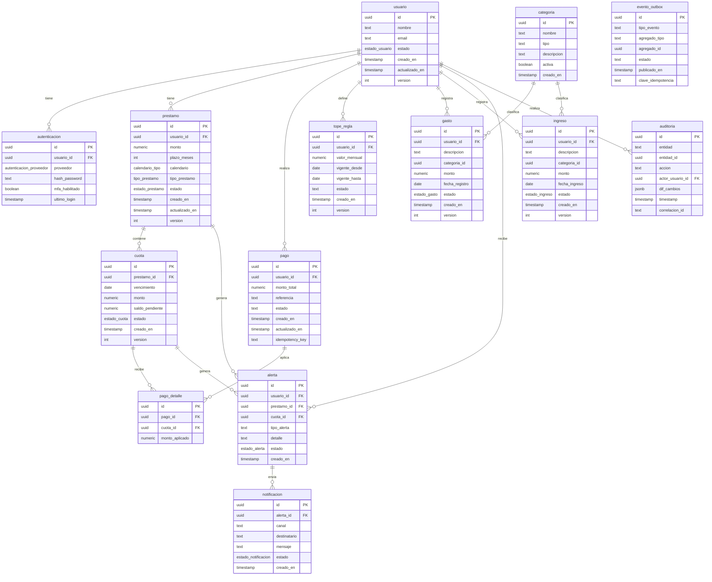

# OptiCash - Modelo Entidad-Relación (BD)

## 📋 Resumen

Este documento describe el modelo entidad-relación de la base de datos de OptiCash, incluyendo todas las entidades, atributos, relaciones y restricciones que soportan las funcionalidades del sistema.

## 🏗️ Diagrama de Entidad-Relación

### Modelo Actual Implementado



## 📊 Descripción de Entidades

### 1. Entidades Principales

#### **usuario**
**Propósito:** Almacena la información básica y de perfil de cada usuario del sistema.

| Atributo | Tipo | Descripción | Restricciones |
|----------|------|-------------|---------------|
| `id` | UUID | Identificador único del usuario | PK, NOT NULL |
| `nombre` | TEXT | Nombre completo del usuario | NOT NULL |
| `email` | TEXT | Correo electrónico del usuario | NOT NULL, UNIQUE |
| `estado` | ENUM | Estado actual del usuario | NOT NULL |
| `creado_en` | TIMESTAMP | Fecha y hora de creación | NOT NULL |
| `actualizado_en` | TIMESTAMP | Última actualización | NOT NULL |
| `version` | INT | Control de concurrencia optimista | NOT NULL |

**Valores del ENUM `estado_usuario`:**
- `activo` - Usuario activo en el sistema
- `inactivo` - Usuario inactivo temporalmente
- `bloqueado` - Usuario bloqueado por seguridad
- `suspendido` - Usuario suspendido por políticas

---

#### **autenticacion**
**Propósito:** Gestiona las credenciales y configuraciones de seguridad para el acceso del usuario.

| Atributo | Tipo | Descripción | Restricciones |
|----------|------|-------------|---------------|
| `id` | UUID | Identificador único del registro | PK, NOT NULL |
| `usuario_id` | UUID | Referencia al usuario | FK, NOT NULL |
| `proveedor` | ENUM | Proveedor de autenticación | NOT NULL |
| `hash_password` | TEXT | Hash de la contraseña | NOT NULL |
| `mfa_habilitado` | BOOLEAN | Autenticación multifactor | NOT NULL, DEFAULT false |
| `ultimo_login` | TIMESTAMP | Último inicio de sesión | NULLABLE |

**Valores del ENUM `autenticacion_proveedor`:**
- `local` - Autenticación local del sistema
- `google` - Autenticación con Google
- `facebook` - Autenticación con Facebook
- `microsoft` - Autenticación con Microsoft

---

#### **prestamo**
**Propósito:** Almacena los detalles de cada préstamo registrado por un usuario.

| Atributo | Tipo | Descripción | Restricciones |
|----------|------|-------------|---------------|
| `id` | UUID | Identificador único del préstamo | PK, NOT NULL |
| `usuario_id` | UUID | Referencia al usuario prestatario | FK, NOT NULL |
| `monto` | NUMERIC(15,2) | Monto total del préstamo | NOT NULL, > 0 |
| `plazo_meses` | INT | Plazo del préstamo en meses | NOT NULL, > 0 |
| `calendario` | ENUM | Tipo de calendario de pagos | NOT NULL |
| `tipo_prestamo` | ENUM | Tipo de préstamo | NOT NULL |
| `estado` | ENUM | Estado actual del préstamo | NOT NULL |
| `creado_en` | TIMESTAMP | Fecha de creación | NOT NULL |
| `actualizado_en` | TIMESTAMP | Última actualización | NOT NULL |
| `version` | INT | Control de concurrencia | NOT NULL |

**Valores del ENUM `calendario_tipo`:**
- `mensual` - Pagos mensuales
- `quincenal` - Pagos quincenales
- `semanal` - Pagos semanales
- `diario` - Pagos diarios

**Valores del ENUM `tipo_prestamo`:**
- `personal` - Préstamo personal
- `hipotecario` - Préstamo hipotecario
- `vehicular` - Préstamo vehicular
- `educativo` - Préstamo educativo

**Valores del ENUM `estado_prestamo`:**
- `activo` - Préstamo activo
- `pagado` - Préstamo completamente pagado
- `vencido` - Préstamo vencido
- `cancelado` - Préstamo cancelado

---

#### **cuota**
**Propósito:** Detalla cada una de las mensualidades o pagos programados para un préstamo.

| Atributo | Tipo | Descripción | Restricciones |
|----------|------|-------------|---------------|
| `id` | UUID | Identificador único de la cuota | PK, NOT NULL |
| `prestamo_id` | UUID | Referencia al préstamo | FK, NOT NULL |
| `vencimiento` | DATE | Fecha de vencimiento | NOT NULL |
| `monto` | NUMERIC(15,2) | Monto total de la cuota | NOT NULL, > 0 |
| `saldo_pendiente` | NUMERIC(15,2) | Saldo pendiente de pago | NOT NULL, >= 0 |
| `estado` | ENUM | Estado de la cuota | NOT NULL |
| `creado_en` | TIMESTAMP | Fecha de creación | NOT NULL |
| `version` | INT | Control de concurrencia | NOT NULL |

**Valores del ENUM `estado_cuota`:**
- `pendiente` - Cuota pendiente de pago
- `pagada` - Cuota completamente pagada
- `vencida` - Cuota vencida sin pago
- `parcial` - Cuota pagada parcialmente

---

#### **pago**
**Propósito:** Registra los pagos realizados por los usuarios.

| Atributo | Tipo | Descripción | Restricciones |
|----------|------|-------------|---------------|
| `id` | UUID | Identificador único del pago | PK, NOT NULL |
| `usuario_id` | UUID | Referencia al usuario | FK, NOT NULL |
| `monto_total` | NUMERIC(15,2) | Monto total del pago | NOT NULL, > 0 |
| `referencia` | TEXT | Referencia de transacción | NOT NULL, UNIQUE |
| `estado` | TEXT | Estado del pago | NOT NULL |
| `creado_en` | TIMESTAMP | Fecha de creación | NOT NULL |
| `actualizado_en` | TIMESTAMP | Última actualización | NOT NULL |
| `idempotency_key` | TEXT | Clave de idempotencia | NOT NULL, UNIQUE |

**Valores del `estado`:**
- `pendiente` - Pago pendiente de procesamiento
- `procesando` - Pago en proceso
- `completado` - Pago exitoso
- `fallido` - Pago fallido
- `cancelado` - Pago cancelado

---

#### **pago_detalle**
**Propósito:** Relaciona un pago con una o varias cuotas, permitiendo pagos parciales o abonos a capital.

| Atributo | Tipo | Descripción | Restricciones |
|----------|------|-------------|---------------|
| `id` | UUID | Identificador único del detalle | PK, NOT NULL |
| `pago_id` | UUID | Referencia al pago | FK, NOT NULL |
| `cuota_id` | UUID | Referencia a la cuota | FK, NOT NULL |
| `monto_aplicado` | NUMERIC(15,2) | Monto aplicado a la cuota | NOT NULL, > 0 |

---

### 2. Entidades de Gestión Financiera

#### **gasto**
**Propósito:** Registra los gastos incurridos por los usuarios.

| Atributo | Tipo | Descripción | Restricciones |
|----------|------|-------------|---------------|
| `id` | UUID | Identificador único del gasto | PK, NOT NULL |
| `usuario_id` | UUID | Referencia al usuario | FK, NOT NULL |
| `descripcion` | TEXT | Descripción del gasto | NOT NULL |
| `categoria_id` | UUID | Referencia a la categoría | FK, NOT NULL |
| `monto` | NUMERIC(15,2) | Monto del gasto | NOT NULL, > 0 |
| `fecha_registro` | DATE | Fecha del gasto | NOT NULL |
| `estado` | ENUM | Estado del gasto | NOT NULL |
| `creado_en` | TIMESTAMP | Fecha de creación | NOT NULL |
| `version` | INT | Control de concurrencia | NOT NULL |

**Valores del ENUM `estado_gasto`:**
- `activo` - Gasto activo
- `eliminado` - Gasto eliminado
- `modificado` - Gasto modificado

---

#### **ingreso**
**Propósito:** Registra los ingresos obtenidos por los usuarios.

| Atributo | Tipo | Descripción | Restricciones |
|----------|------|-------------|---------------|
| `id` | UUID | Identificador único del ingreso | PK, NOT NULL |
| `usuario_id` | UUID | Referencia al usuario | FK, NOT NULL |
| `descripcion` | TEXT | Descripción del ingreso | NOT NULL |
| `categoria_id` | UUID | Referencia a la categoría | FK, NOT NULL |
| `monto` | NUMERIC(15,2) | Monto del ingreso | NOT NULL, > 0 |
| `fecha_ingreso` | DATE | Fecha del ingreso | NOT NULL |
| `estado` | ENUM | Estado del ingreso | NOT NULL |
| `creado_en` | TIMESTAMP | Fecha de creación | NOT NULL |
| `version` | INT | Control de concurrencia | NOT NULL |

**Valores del ENUM `estado_ingreso`:**
- `activo` - Ingreso activo
- `eliminado` - Ingreso eliminado
- `modificado` - Ingreso modificado

---

#### **categoria**
**Propósito:** Clasifica los gastos e ingresos en categorías predefinidas.

| Atributo | Tipo | Descripción | Restricciones |
|----------|------|-------------|---------------|
| `id` | UUID | Identificador único de la categoría | PK, NOT NULL |
| `nombre` | TEXT | Nombre de la categoría | NOT NULL |
| `tipo` | TEXT | Tipo de categoría | NOT NULL |
| `descripcion` | TEXT | Descripción de la categoría | NULLABLE |
| `activa` | BOOLEAN | Estado de la categoría | NOT NULL, DEFAULT true |
| `creado_en` | TIMESTAMP | Fecha de creación | NOT NULL |

**Valores del `tipo`:**
- `gasto` - Categoría para gastos
- `ingreso` - Categoría para ingresos

---

### 3. Entidades de Configuración y Reglas

#### **tope_regla**
**Propósito:** Permite definir reglas personalizadas para los usuarios, como límites de gastos o sugerencias.

| Atributo | Tipo | Descripción | Restricciones |
|----------|------|-------------|---------------|
| `id` | UUID | Identificador único de la regla | PK, NOT NULL |
| `usuario_id` | UUID | Referencia al usuario | FK, NOT NULL |
| `valor_mensual` | NUMERIC(15,2) | Valor límite mensual | NOT NULL, > 0 |
| `vigente_desde` | DATE | Fecha de inicio de vigencia | NOT NULL |
| `vigente_hasta` | DATE | Fecha de fin de vigencia | NOT NULL |
| `estado` | TEXT | Estado de la regla | NOT NULL |
| `creado_en` | TIMESTAMP | Fecha de creación | NOT NULL |
| `version` | INT | Control de concurrencia | NOT NULL |

---

### 4. Entidades de Notificaciones y Alertas

#### **alerta**
**Propósito:** Almacena información sobre alertas generadas para los usuarios.

| Atributo | Tipo | Descripción | Restricciones |
|----------|------|-------------|---------------|
| `id` | UUID | Identificador único de la alerta | PK, NOT NULL |
| `usuario_id` | UUID | Referencia al usuario | FK, NOT NULL |
| `prestamo_id` | UUID | Referencia al préstamo | FK, NULLABLE |
| `cuota_id` | UUID | Referencia a la cuota | FK, NULLABLE |
| `tipo_alerta` | TEXT | Tipo de alerta | NOT NULL |
| `detalle` | TEXT | Descripción de la alerta | NOT NULL |
| `estado` | ENUM | Estado de la alerta | NOT NULL |
| `creado_en` | TIMESTAMP | Fecha de creación | NOT NULL |

**Valores del ENUM `estado_alerta`:**
- `activa` - Alerta activa
- `resuelta` - Alerta resuelta
- `expirada` - Alerta expirada

---

#### **notificacion**
**Propósito:** Registra las notificaciones enviadas a los usuarios.

| Atributo | Tipo | Descripción | Restricciones |
|----------|------|-------------|---------------|
| `id` | UUID | Identificador único de la notificación | PK, NOT NULL |
| `alerta_id` | UUID | Referencia a la alerta | FK, NOT NULL |
| `canal` | TEXT | Canal de notificación | NOT NULL |
| `destinatario` | TEXT | Destinatario de la notificación | NOT NULL |
| `mensaje` | TEXT | Contenido del mensaje | NOT NULL |
| `estado` | ENUM | Estado de la notificación | NOT NULL |
| `creado_en` | TIMESTAMP | Fecha de creación | NOT NULL |

**Valores del ENUM `estado_notificacion`:**
- `pendiente` - Notificación pendiente
- `enviada` - Notificación enviada
- `leida` - Notificación leída
- `fallida` - Notificación fallida

---

### 5. Entidades de Auditoría y Eventos

#### **auditoria**
**Propósito:** Registra todas las operaciones críticas para auditoría y seguridad.

| Atributo | Tipo | Descripción | Restricciones |
|----------|------|-------------|---------------|
| `id` | UUID | Identificador único del registro | PK, NOT NULL |
| `entidad` | TEXT | Nombre de la entidad afectada | NOT NULL |
| `entidad_id` | UUID | ID de la instancia afectada | NOT NULL |
| `accion` | TEXT | Acción realizada | NOT NULL |
| `actor_usuario_id` | UUID | Usuario que realizó la acción | FK, NOT NULL |
| `dif_cambios` | JSONB | Diferencia de los cambios | NULLABLE |
| `timestamp` | TIMESTAMP | Fecha y hora de la acción | NOT NULL |
| `correlacion_id` | TEXT | ID de correlación | NULLABLE |

---

#### **evento_outbox**
**Propósito:** Implementa el patrón Outbox para consistencia en arquitecturas distribuidas.

| Atributo | Tipo | Descripción | Restricciones |
|----------|------|-------------|---------------|
| `id` | UUID | Identificador único del evento | PK, NOT NULL |
| `tipo_evento` | TEXT | Tipo de evento | NOT NULL |
| `agregado_tipo` | TEXT | Tipo de agregado | NOT NULL |
| `agregado_id` | UUID | ID del agregado | NOT NULL |
| `estado` | TEXT | Estado del evento | NOT NULL |
| `publicado_en` | TIMESTAMP | Fecha de publicación | NULLABLE |
| `clave_idempotencia` | TEXT | Clave de idempotencia | NOT NULL, UNIQUE |

## 🔗 Relaciones Principales

### 1. Relaciones de Usuario
- **usuario** → **autenticacion** (1:1)
- **usuario** → **prestamo** (1:N)
- **usuario** → **pago** (1:N)
- **usuario** → **gasto** (1:N)
- **usuario** → **ingreso** (1:N)
- **usuario** → **tope_regla** (1:N)
- **usuario** → **alerta** (1:N)
- **usuario** → **auditoria** (1:N)

### 2. Relaciones de Préstamo
- **prestamo** → **cuota** (1:N)
- **prestamo** → **alerta** (1:N)

### 3. Relaciones de Pago
- **pago** → **pago_detalle** (1:N)
- **cuota** → **pago_detalle** (1:N)

### 4. Relaciones de Categorización
- **categoria** → **gasto** (1:N)
- **categoria** → **ingreso** (1:N)

### 5. Relaciones de Notificación
- **alerta** → **notificacion** (1:N)

## 📋 Índices Recomendados

### Índices Primarios
- Todas las claves primarias (UUID) tienen índices automáticos

### Índices de Rendimiento
```sql
-- Índices para consultas frecuentes
CREATE INDEX idx_usuario_email ON usuario(email);
CREATE INDEX idx_prestamo_usuario_estado ON prestamo(usuario_id, estado);
CREATE INDEX idx_cuota_prestamo_estado ON cuota(prestamo_id, estado);
CREATE INDEX idx_pago_usuario_fecha ON pago(usuario_id, creado_en);
CREATE INDEX idx_gasto_usuario_fecha ON gasto(usuario_id, fecha_registro);
CREATE INDEX idx_ingreso_usuario_fecha ON ingreso(usuario_id, fecha_ingreso);
CREATE INDEX idx_alerta_usuario_estado ON alerta(usuario_id, estado);
CREATE INDEX idx_auditoria_entidad_fecha ON auditoria(entidad, timestamp);
CREATE INDEX idx_evento_outbox_estado ON evento_outbox(estado);
```

### Índices Compuestos
```sql
-- Índices para consultas complejas
CREATE INDEX idx_cuota_vencimiento_estado ON cuota(vencimiento, estado);
CREATE INDEX idx_pago_detalle_pago_cuota ON pago_detalle(pago_id, cuota_id);
CREATE INDEX idx_gasto_categoria_fecha ON gasto(categoria_id, fecha_registro);
CREATE INDEX idx_ingreso_categoria_fecha ON ingreso(categoria_id, fecha_ingreso);
```

## 🔒 Restricciones de Integridad

### Restricciones de Clave Foránea
```sql
-- Restricciones de integridad referencial
ALTER TABLE autenticacion ADD CONSTRAINT fk_autenticacion_usuario 
    FOREIGN KEY (usuario_id) REFERENCES usuario(id) ON DELETE CASCADE;

ALTER TABLE prestamo ADD CONSTRAINT fk_prestamo_usuario 
    FOREIGN KEY (usuario_id) REFERENCES usuario(id) ON DELETE CASCADE;

ALTER TABLE cuota ADD CONSTRAINT fk_cuota_prestamo 
    FOREIGN KEY (prestamo_id) REFERENCES prestamo(id) ON DELETE CASCADE;

ALTER TABLE pago ADD CONSTRAINT fk_pago_usuario 
    FOREIGN KEY (usuario_id) REFERENCES usuario(id) ON DELETE CASCADE;

ALTER TABLE pago_detalle ADD CONSTRAINT fk_pago_detalle_pago 
    FOREIGN KEY (pago_id) REFERENCES pago(id) ON DELETE CASCADE;

ALTER TABLE pago_detalle ADD CONSTRAINT fk_pago_detalle_cuota 
    FOREIGN KEY (cuota_id) REFERENCES cuota(id) ON DELETE CASCADE;

-- Restricciones para gastos e ingresos
ALTER TABLE gasto ADD CONSTRAINT fk_gasto_usuario 
    FOREIGN KEY (usuario_id) REFERENCES usuario(id) ON DELETE CASCADE;

ALTER TABLE gasto ADD CONSTRAINT fk_gasto_categoria 
    FOREIGN KEY (categoria_id) REFERENCES categoria(id) ON DELETE RESTRICT;

ALTER TABLE ingreso ADD CONSTRAINT fk_ingreso_usuario 
    FOREIGN KEY (usuario_id) REFERENCES usuario(id) ON DELETE CASCADE;

ALTER TABLE ingreso ADD CONSTRAINT fk_ingreso_categoria 
    FOREIGN KEY (categoria_id) REFERENCES categoria(id) ON DELETE RESTRICT;
```

### Restricciones de Dominio
```sql
-- Restricciones de valores válidos
ALTER TABLE usuario ADD CONSTRAINT chk_usuario_estado 
    CHECK (estado IN ('activo', 'inactivo', 'bloqueado', 'suspendido'));

ALTER TABLE prestamo ADD CONSTRAINT chk_prestamo_monto 
    CHECK (monto > 0);

ALTER TABLE prestamo ADD CONSTRAINT chk_prestamo_plazo 
    CHECK (plazo_meses > 0);

ALTER TABLE cuota ADD CONSTRAINT chk_cuota_monto 
    CHECK (monto > 0);

ALTER TABLE cuota ADD CONSTRAINT chk_cuota_saldo 
    CHECK (saldo_pendiente >= 0);

ALTER TABLE pago ADD CONSTRAINT chk_pago_monto 
    CHECK (monto_total > 0);

ALTER TABLE gasto ADD CONSTRAINT chk_gasto_monto 
    CHECK (monto > 0);

ALTER TABLE ingreso ADD CONSTRAINT chk_ingreso_monto 
    CHECK (monto > 0);
```

## 🚀 Optimizaciones de Rendimiento

### Particionamiento
```sql
-- Particionamiento por fecha para tablas grandes
-- Ejemplo para tabla de auditoría
CREATE TABLE auditoria_2024 PARTITION OF auditoria 
    FOR VALUES FROM ('2024-01-01') TO ('2025-01-01');

CREATE TABLE auditoria_2025 PARTITION OF auditoria 
    FOR VALUES FROM ('2025-01-01') TO ('2026-01-01');
```

### Vistas Materializadas
```sql
-- Vista materializada para dashboard
CREATE MATERIALIZED VIEW dashboard_resumen AS
SELECT 
    u.id as usuario_id,
    u.nombre,
    COALESCE(SUM(i.monto), 0) as total_ingresos,
    COALESCE(SUM(g.monto), 0) as total_gastos,
    COALESCE(SUM(p.monto_total), 0) as total_pagos,
    COUNT(DISTINCT pr.id) as prestamos_activos
FROM usuario u
LEFT JOIN ingreso i ON u.id = i.usuario_id AND i.estado = 'activo'
LEFT JOIN gasto g ON u.id = g.usuario_id AND g.estado = 'activo'
LEFT JOIN pago p ON u.id = p.usuario_id AND p.estado = 'completado'
LEFT JOIN prestamo pr ON u.id = pr.usuario_id AND pr.estado = 'activo'
GROUP BY u.id, u.nombre;

-- Refrescar vista materializada
REFRESH MATERIALIZED VIEW dashboard_resumen;
```

## ✅ Criterios de Aceptación

### Cobertura de Requerimientos
- ✅ **RF-001:** Gestión de usuarios (tabla `usuario`, `autenticacion`)
- ✅ **RF-002:** Gestión de ingresos (tabla `ingreso`, `categoria`)
- ✅ **RF-003:** Gestión de gastos (tabla `gasto`, `categoria`)
- ✅ **RF-004:** Gestión de préstamos (tabla `prestamo`, `cuota`)
- ✅ **RF-005:** Gestión de pagos (tabla `pago`, `pago_detalle`)
- ✅ **RF-006:** Sugerencias inteligentes (tabla `tope_regla`, `alerta`)
- ✅ **RF-007:** Reportes y visualizaciones (tabla `auditoria`)

### Calidad del Modelo
- ✅ **Normalización:** Tercera forma normal (3NF)
- ✅ **Integridad:** Restricciones de clave foránea
- ✅ **Escalabilidad:** Uso de UUIDs y patrón Outbox
- ✅ **Auditoría:** Tabla de auditoría completa
- ✅ **Flexibilidad:** Enums para valores predefinidos
- ✅ **Rendimiento:** Índices optimizados

### Preparación para Microservicios
- ✅ **Eventos:** Tabla `evento_outbox` para eventos de dominio
- ✅ **Idempotencia:** Claves de idempotencia en pagos
- ✅ **Correlación:** IDs de correlación en auditoría
- ✅ **Desacoplamiento:** Entidades bien definidas por dominio

---

**Modelo Entidad-Relación OptiCash** - Versión 1.0
