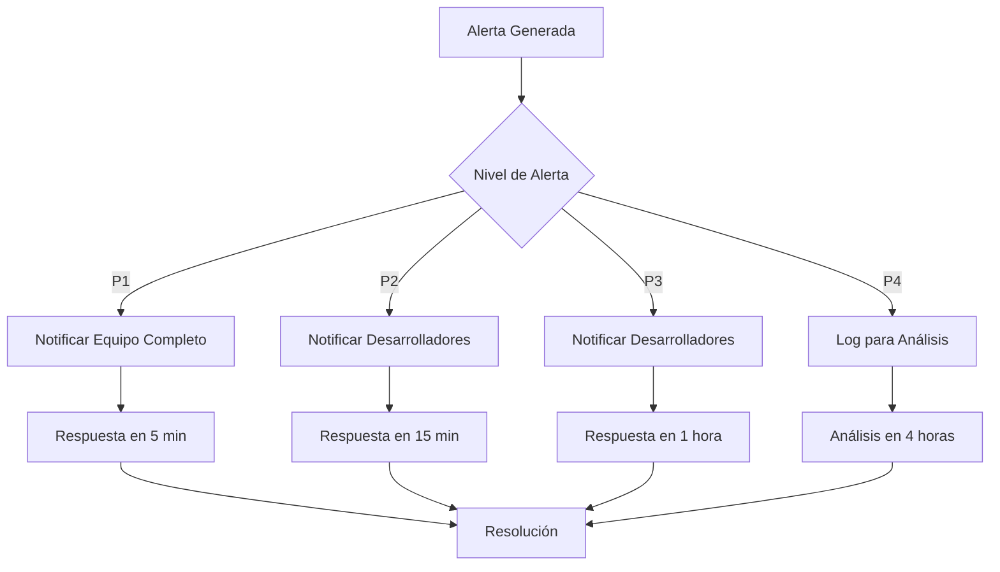
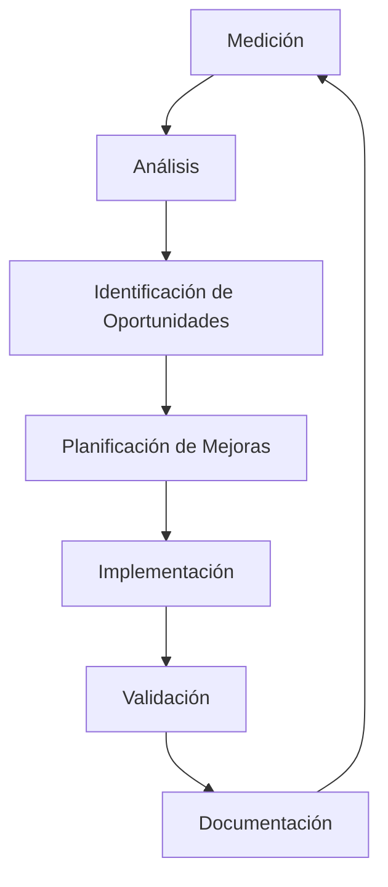

# OptiCash - Documento de Calidad de Servicio (QoS)

## 📋 Resumen

Este documento define la Calidad de Servicio (QoS) del sistema OptiCash, estableciendo métricas de rendimiento, Service Level Agreements (SLAs), procedimientos de monitoreo y estrategias de mejora continua.

## 🎯 Objetivos de Calidad

### Misión de QoS
Garantizar que OptiCash proporcione un servicio financiero confiable, rápido y seguro, cumpliendo con los más altos estándares de calidad para aplicaciones financieras personales.

### Principios de Calidad
1. **Confiabilidad:** Disponibilidad 99.95% del tiempo
2. **Rendimiento:** Respuesta rápida y consistente
3. **Seguridad:** Protección robusta de datos financieros
4. **Escalabilidad:** Crecimiento sin degradación de servicio
5. **Usabilidad:** Experiencia de usuario excepcional

## 📊 Métricas de Rendimiento

### 1. Disponibilidad (Availability)

#### SLA de Disponibilidad
- **Objetivo:** 99.95% uptime mensual
- **Tiempo de Downtime Permitido:** 21.6 minutos/mes
- **Medición:** Tiempo de respuesta HTTP 200-299

#### Métricas de Disponibilidad
| Métrica | Objetivo | Crítico | Medición |
|---------|----------|---------|----------|
| Uptime General | 99.95% | 99.9% | Por minuto |
| Uptime API | 99.95% | 99.9% | Por endpoint |
| Uptime Base de Datos | 99.99% | 99.95% | Por conexión |
| Uptime Servicios Externos | 99.9% | 99.5% | Por servicio |

#### Procedimientos de Disponibilidad
- **Monitoreo Continuo:** Health checks cada 30 segundos
- **Alertas:** Notificación inmediata si uptime < 99.9%
- **Escalación:** Equipo de respuesta en 5 minutos
- **Recuperación:** RTO (Recovery Time Objective) < 10 minutos

### 2. Rendimiento (Performance)

#### SLA de Rendimiento
- **Tiempo de Respuesta P95:** < 1.5 segundos
- **Tiempo de Respuesta P99:** < 3 segundos
- **Throughput:** 200 requests/segundo
- **Concurrencia:** 500 usuarios simultáneos

#### Métricas de Rendimiento por Endpoint
| Endpoint | P95 (ms) | P99 (ms) | Throughput (RPS) |
|----------|----------|----------|------------------|
| POST /auth/login | 500 | 1000 | 50 |
| GET /dashboard | 800 | 1500 | 100 |
| POST /payments | 1000 | 2000 | 30 |
| GET /suggestions | 2000 | 3000 | 20 |
| GET /reports | 3000 | 5000 | 10 |

#### Procedimientos de Rendimiento
- **Monitoreo:** Métricas en tiempo real
- **Alertas:** Si P95 > 1.5s o P99 > 3s
- **Optimización:** Análisis semanal de bottlenecks
- **Escalado:** Auto-scaling basado en métricas

### 3. Capacidad (Capacity)

#### SLA de Capacidad
- **Usuarios Concurrentes:** 500 simultáneos
- **Transacciones por Segundo:** 200 TPS
- **Almacenamiento:** 1TB inicial, escalable
- **Ancho de Banda:** 100 Mbps garantizado

#### Planes de Capacidad
| Recurso | Actual | 6 meses | 12 meses | 24 meses |
|---------|--------|---------|----------|----------|
| Usuarios Concurrentes | 500 | 1,000 | 2,000 | 5,000 |
| TPS | 200 | 400 | 800 | 2,000 |
| Almacenamiento | 1TB | 5TB | 20TB | 100TB |
| CPU | 8 cores | 16 cores | 32 cores | 64 cores |
| RAM | 32GB | 64GB | 128GB | 256GB |

### 4. Confiabilidad (Reliability)

#### SLA de Confiabilidad
- **MTBF (Mean Time Between Failures):** > 720 horas
- **MTTR (Mean Time To Repair):** < 10 minutos
- **Error Rate:** < 0.1%
- **Data Loss:** 0% (Zero data loss)

#### Métricas de Confiabilidad
| Métrica | Objetivo | Medición |
|---------|----------|----------|
| Error Rate | < 0.1% | Por request |
| Timeout Rate | < 0.05% | Por request |
| Data Consistency | 100% | Por transacción |
| Backup Success | 100% | Diario |

### 5. Seguridad (Security)

#### SLA de Seguridad
- **Vulnerabilidades Críticas:** 0 (Zero tolerance)
- **Tiempo de Parcheo:** < 24 horas
- **Accesos No Autorizados:** 0
- **Filtración de Datos:** 0

#### Métricas de Seguridad
| Métrica | Objetivo | Medición |
|---------|----------|----------|
| Vulnerabilidades Críticas | 0 | Escaneo diario |
| Intentos de Intrusión | 0 | Monitoreo 24/7 |
| Datos Filtrados | 0 | Auditoría continua |
| Certificados SSL | 100% válidos | Verificación diaria |

## 🔧 Procedimientos de Monitoreo

### 1. Monitoreo en Tiempo Real

#### Herramientas de Monitoreo
- **APM:** New Relic / Datadog
- **Logs:** ELK Stack (Elasticsearch, Logstash, Kibana)
- **Métricas:** Prometheus + Grafana
- **Alertas:** PagerDuty / OpsGenie

#### Dashboards de Monitoreo
```yaml
Dashboard Principal:
  - Uptime por servicio
  - Tiempo de respuesta por endpoint
  - Throughput y concurrencia
  - Errores por minuto
  - Uso de recursos (CPU, RAM, DB)

Dashboard de Seguridad:
  - Intentos de login fallidos
  - Requests sospechosos
  - Vulnerabilidades detectadas
  - Accesos no autorizados

Dashboard de Negocio:
  - Usuarios activos
  - Transacciones procesadas
  - Sugerencias generadas
  - Satisfacción del usuario
```

### 2. Alertas y Escalación

#### Niveles de Alerta
| Nivel | Condición | Tiempo de Respuesta | Acción |
|-------|-----------|-------------------|--------|
| **P1 - Crítico** | Uptime < 99% | 5 minutos | Equipo completo |
| **P2 - Alto** | P95 > 2s | 15 minutos | Equipo de desarrollo |
| **P3 - Medio** | P95 > 1.5s | 1 hora | Equipo de desarrollo |
| **P4 - Bajo** | P95 > 1s | 4 horas | Monitoreo |

#### Procedimientos de Escalación


### 3. Métricas de Negocio

#### KPIs de Calidad
| KPI | Objetivo | Medición |
|-----|----------|----------|
| Tiempo de Carga de Dashboard | < 2s | P95 |
| Tiempo de Generación de Sugerencias | < 3s | P95 |
| Tasa de Éxito de Pagos | > 99.5% | Por transacción |
| Satisfacción del Usuario | > 4.5/5 | Encuesta mensual |
| Tiempo de Resolución de Tickets | < 4 horas | Por ticket |

#### Métricas de Adopción
- **Usuarios Activos Diarios (DAU):** Crecimiento 20% mensual
- **Usuarios Activos Mensuales (MAU):** Crecimiento 15% mensual
- **Retención de Usuarios:** > 80% a 30 días
- **Tiempo de Sesión:** > 10 minutos promedio

## 📈 Estrategias de Mejora Continua

### 1. Análisis de Rendimiento

#### Revisión Semanal
- Análisis de métricas de rendimiento
- Identificación de bottlenecks
- Planificación de optimizaciones
- Revisión de alertas y incidentes

#### Revisión Mensual
- Análisis de tendencias de QoS
- Evaluación de SLAs
- Planificación de capacidad
- Revisión de procedimientos

#### Revisión Trimestral
- Evaluación de objetivos de QoS
- Actualización de SLAs
- Planificación de mejoras arquitectónicas
- Revisión de herramientas de monitoreo

### 2. Optimización Continua

#### Optimizaciones de Código
- **Profiling:** Análisis semanal de performance
- **Refactoring:** Mejoras continuas de código
- **Caching:** Implementación estratégica de cache
- **Database:** Optimización de queries y índices

#### Optimizaciones de Infraestructura
- **Auto-scaling:** Ajuste automático de recursos
- **Load Balancing:** Distribución óptima de carga
- **CDN:** Cache de assets estáticos
- **Database:** Replicación y sharding

### 3. Pruebas de Carga

#### Pruebas Regulares
- **Semanal:** Pruebas de carga básicas
- **Mensual:** Pruebas de estrés completas
- **Trimestral:** Pruebas de capacidad máxima
- **Pre-release:** Pruebas de carga en staging

#### Escenarios de Prueba
```yaml
Escenario Básico:
  - 100 usuarios concurrentes
  - 50 TPS
  - Duración: 30 minutos

Escenario de Carga:
  - 500 usuarios concurrentes
  - 200 TPS
  - Duración: 1 hora

Escenario de Estrés:
  - 1000 usuarios concurrentes
  - 400 TPS
  - Duración: 2 horas

Escenario de Pico:
  - 2000 usuarios concurrentes
  - 800 TPS
  - Duración: 30 minutos
```

## 🚨 Procedimientos de Incidentes

### 1. Clasificación de Incidentes

#### Severidad P1 - Crítico
- **Uptime < 99%**
- **Error rate > 1%**
- **Data loss**
- **Security breach**

#### Severidad P2 - Alto
- **Uptime < 99.5%**
- **P95 > 2 segundos**
- **Funcionalidad principal afectada**
- **Performance degradado**

#### Severidad P3 - Medio
- **P95 > 1.5 segundos**
- **Funcionalidad secundaria afectada**
- **Degradación menor**

#### Severidad P4 - Bajo
- **P95 > 1 segundo**
- **Mejoras menores**
- **Optimizaciones**

### 2. Procedimientos de Respuesta

#### Respuesta Inmediata (P1)
1. **Detección:** < 1 minuto
2. **Notificación:** < 2 minutos
3. **Respuesta:** < 5 minutos
4. **Resolución:** < 30 minutos

#### Post-Incidente
1. **Post-mortem:** < 24 horas
2. **Acciones correctivas:** < 48 horas
3. **Implementación:** < 1 semana
4. **Seguimiento:** < 1 mes

## 📋 SLAs por Servicio

### 1. Servicio de Autenticación
- **Disponibilidad:** 99.99%
- **Tiempo de Respuesta:** P95 < 500ms
- **Throughput:** 100 RPS
- **Error Rate:** < 0.01%

### 2. Servicio de Pagos
- **Disponibilidad:** 99.95%
- **Tiempo de Respuesta:** P95 < 1000ms
- **Throughput:** 50 RPS
- **Error Rate:** < 0.05%

### 3. Servicio de Sugerencias
- **Disponibilidad:** 99.9%
- **Tiempo de Respuesta:** P95 < 2000ms
- **Throughput:** 20 RPS
- **Error Rate:** < 0.1%

### 4. Servicio de Reportes
- **Disponibilidad:** 99.5%
- **Tiempo de Respuesta:** P95 < 3000ms
- **Throughput:** 10 RPS
- **Error Rate:** < 0.2%

## 🔄 Procesos de Mejora

### 1. Ciclo de Mejora Continua



### 2. Métricas de Mejora

#### Objetivos de Mejora Anual
- **Reducir tiempo de respuesta P95 en 20%**
- **Aumentar disponibilidad a 99.98%**
- **Reducir MTTR en 50%**
- **Mejorar satisfacción del usuario en 15%**

#### Indicadores de Progreso
- **Métricas semanales:** Tendencias de rendimiento
- **Métricas mensuales:** Cumplimiento de SLAs
- **Métricas trimestrales:** Objetivos anuales
- **Métricas anuales:** Evaluación completa

## 📊 Reportes de QoS

### 1. Reportes Diarios
- **Resumen de disponibilidad**
- **Métricas de rendimiento**
- **Alertas y incidentes**
- **Uso de recursos**

### 2. Reportes Semanales
- **Análisis de tendencias**
- **Identificación de problemas**
- **Planificación de mejoras**
- **Comparación con SLAs**

### 3. Reportes Mensuales
- **Cumplimiento de SLAs**
- **Análisis de capacidad**
- **Evolución de métricas**
- **Planificación estratégica**

### 4. Reportes Trimestrales
- **Evaluación de objetivos**
- **Análisis de ROI**
- **Planificación de inversiones**
- **Actualización de SLAs**

## 🎯 Objetivos de QoS 2024

### Q1 2024
- **Disponibilidad:** 99.9%
- **P95:** < 2 segundos
- **Usuarios concurrentes:** 500
- **Error rate:** < 0.5%

### Q2 2024
- **Disponibilidad:** 99.95%
- **P95:** < 1.5 segundos
- **Usuarios concurrentes:** 750
- **Error rate:** < 0.2%

### Q3 2024
- **Disponibilidad:** 99.95%
- **P95:** < 1.2 segundos
- **Usuarios concurrentes:** 1000
- **Error rate:** < 0.1%

### Q4 2024
- **Disponibilidad:** 99.98%
- **P95:** < 1 segundo
- **Usuarios concurrentes:** 1500
- **Error rate:** < 0.05%

## ✅ Criterios de Aceptación

### Disponibilidad
- ✅ Uptime ≥ 99.95%
- ✅ MTTR < 10 minutos
- ✅ Health checks funcionando
- ✅ Alertas configuradas

### Rendimiento
- ✅ P95 < 1.5 segundos
- ✅ P99 < 3 segundos
- ✅ Throughput ≥ 200 RPS
- ✅ Concurrencia ≥ 500 usuarios

### Seguridad
- ✅ 0 vulnerabilidades críticas
- ✅ Monitoreo 24/7
- ✅ Auditoría continua
- ✅ Respuesta < 24 horas

### Escalabilidad
- ✅ Auto-scaling funcional
- ✅ Capacidad planificada
- ✅ Pruebas de carga regulares
- ✅ Monitoreo de recursos

---

**Documento QoS OptiCash** - Versión 1.0
