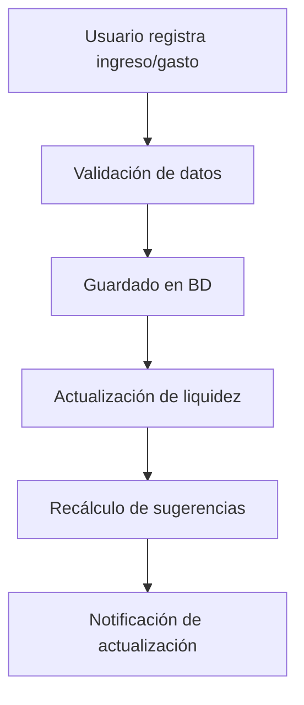
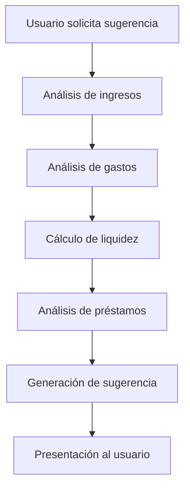
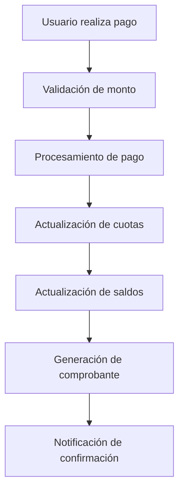

# OptiCash - Requerimientos del Sistema

## 📋 Resumen

Este documento define los requerimientos funcionales y no funcionales del sistema OptiCash, un gestor financiero personal inteligente.

## 🎯 Objetivo del Sistema

OptiCash es un gestor financiero personal que ayuda a los usuarios a:
- Organizar de forma inteligente sus préstamos, gastos e ingresos
- Mantener un historial detallado de movimientos financieros
- Recibir sugerencias inteligentes para optimizar abonos a capital
- Pagar préstamos de manera eficiente sin comprometer liquidez

## 👥 Actores del Sistema

### Actores Principales
1. **Usuario Final:** Persona que gestiona sus finanzas personales
2. **Sistema de IA:** Algoritmos para sugerencias inteligentes
3. **Administrador:** Gestión del sistema

### Actores Secundarios
1. **Sistema de Pagos:** Procesamiento de transacciones
2. **Sistema de Notificaciones:** Envío de alertas
3. **Sistema de Reportes:** Generación de análisis

## 🔧 Requerimientos Funcionales

### RF-001: Gestión de Usuarios
- **RF-001.1:** Registro de usuarios con email y contraseña
- **RF-001.2:** Autenticación JWT con refresh tokens
- **RF-001.3:** Gestión de perfil personal
- **RF-001.4:** Configuración de preferencias

### RF-002: Gestión de Préstamos
- **RF-002.1:** Registro de préstamos con monto, plazo y tipo
- **RF-002.2:** Generación automática de cuotas
- **RF-002.3:** Seguimiento de estado de préstamos
- **RF-002.4:** Cálculo de intereses y saldos

### RF-003: Gestión de Gastos e Ingresos
- **RF-003.1:** Registro de ingresos con categorización
- **RF-003.2:** Registro de gastos con categorización
- **RF-003.3:** Historial detallado de movimientos
- **RF-003.4:** Análisis de patrones de gasto

### RF-004: Sistema de Pagos
- **RF-004.1:** Procesamiento de pagos de cuotas
- **RF-004.2:** Aplicación de pagos a préstamos
- **RF-004.3:** Historial de pagos realizados
- **RF-004.4:** Comprobantes de pago

### RF-005: Sugerencias Inteligentes
- **RF-005.1:** Análisis de ingresos y gastos actuales
- **RF-005.2:** Cálculo de liquidez disponible
- **RF-005.3:** Sugerencias de abono a capital óptimo
- **RF-005.4:** Proyecciones de pago acelerado

### RF-006: Reportes y Análisis
- **RF-006.1:** Dashboard financiero personal
- **RF-006.2:** Reportes de préstamos activos
- **RF-006.3:** Análisis de gastos por categoría
- **RF-006.4:** Proyecciones financieras

## 📊 Requerimientos No Funcionales

### RNF-001: Rendimiento
- **Tiempo de respuesta:** < 2 segundos para 95% de requests
- **Throughput:** 100 usuarios concurrentes
- **Disponibilidad:** 99.9% uptime

### RNF-002: Seguridad
- **Autenticación:** JWT con expiración de 24h
- **Cifrado:** HTTPS para todas las comunicaciones
- **Datos:** Cifrado AES-256 para datos sensibles
- **Validación:** Sanitización de inputs

### RNF-003: Escalabilidad
- **Arquitectura:** Preparada para microservicios
- **Base de datos:** Esquemas separados por dominio
- **Despliegue:** CI/CD con Jenkins
- **Monitoreo:** Métricas en tiempo real

### RNF-004: Usabilidad
- **Interfaz:** Intuitiva y responsive
- **Navegación:** Máximo 3 clics para funciones principales
- **Feedback:** Respuestas inmediatas a acciones
- **Accesibilidad:** WCAG 2.1 AA

## 🏗️ Arquitectura de Microservicios

### Dominios Principales
1. **Usuarios:** Gestión de usuarios y autenticación
2. **Préstamos:** Gestión de préstamos y cuotas
3. **Pagos:** Gestión de pagos, gastos e ingresos

### Comunicación entre Servicios
- **Síncrona:** HTTP REST para operaciones inmediatas
- **Asíncrona:** Event Sourcing para actualizaciones
- **API Gateway:** Routing y autenticación centralizada

### Base de Datos
- **PostgreSQL** con esquemas separados por microservicio
- **Prisma ORM** para cada servicio
- **Migraciones** independientes por servicio

## 🔄 Flujos Principales

### Flujo 1: Registro de Movimiento Financiero

### Flujo 2: Sugerencia Inteligente

### Flujo 3: Procesamiento de Pago

## 📈 Métricas de Éxito

### Métricas de Negocio
- **Adopción:** 80% de usuarios activos mensualmente
- **Engagement:** 5+ sesiones por usuario por semana
- **Efectividad:** 30% mejora en tiempo de pago de préstamos
- **Satisfacción:** NPS > 70

### Métricas Técnicas
- **Rendimiento:** Tiempo de respuesta < 2s
- **Disponibilidad:** 99.9% uptime
- **Errores:** < 0.1% error rate
- **Escalabilidad:** 1000+ usuarios concurrentes

## 🚀 Roadmap de Desarrollo

### Fase 1: Funcionalidades Básicas (Actual)
- ✅ Gestión de usuarios
- ✅ Gestión de préstamos
- ✅ Sistema de pagos
- ✅ Autenticación JWT

### Fase 2: Funcionalidades Avanzadas
- 🔄 Gestión de gastos e ingresos
- 🔄 Sugerencias inteligentes
- 🔄 Dashboard financiero
- 🔄 Reportes y análisis

### Fase 3: Arquitectura de Microservicios
- ⏳ Separación de dominios
- ⏳ API Gateway
- ⏳ Comunicación entre servicios
- ⏳ Despliegues independientes

### Fase 4: CI/CD y Producción
- ⏳ Pipeline de Jenkins
- ⏳ Despliegues automáticos
- ⏳ Monitoreo distribuido
- ⏳ Escalabilidad horizontal

## ✅ Criterios de Aceptación

### Funcionalidad
- Todas las funcionalidades operan según especificación
- Sugerencias inteligentes son precisas y útiles
- Historial de movimientos es completo y detallado

### Rendimiento
- Sistema responde en < 2 segundos
- Maneja 100 usuarios concurrentes
- Disponibilidad de 99.9%

### Seguridad
- Datos protegidos con cifrado
- Autenticación robusta
- Validación de inputs

### Usabilidad
- Interfaz intuitiva y fácil de usar
- Navegación clara y lógica
- Feedback inmediato a acciones

---

**Requerimientos OptiCash** - Versión 1.0
