# OptiCash - Diagramas UML

## 📋 Resumen

Este documento contiene los diagramas UML del sistema OptiCash, incluyendo diagramas de clases, secuencia, casos de uso y componentes que representan la arquitectura y diseño del sistema.

## 🏗️ Diagrama de Clases Principal

### Clases del Dominio Principal

```mermaid
classDiagram
    class Usuario {
        +String id
        +String nombre
        +String email
        +String password_hash
        +String rol
        +String estado
        +DateTime creado_en
        +DateTime actualizado_en
        +DateTime ultimo_acceso
        
        +registrar()
        +autenticar()
        +actualizarPerfil()
        +cambiarPassword()
        +obtenerDashboard()
    }

    class Ingreso {
        +String id
        +String usuario_id
        +Decimal monto
        +String descripcion
        +String categoria
        +Date fecha_ingreso
        +DateTime creado_en
        +DateTime actualizado_en
        
        +crear()
        +actualizar()
        +eliminar()
        +obtenerPorPeriodo()
    }

    class Gasto {
        +String id
        +String usuario_id
        +Decimal monto
        +String descripcion
        +String categoria
        +Date fecha_gasto
        +DateTime creado_en
        +DateTime actualizado_en
        
        +crear()
        +actualizar()
        +eliminar()
        +obtenerPorPeriodo()
    }

    class Prestamo {
        +String id
        +String usuario_id
        +Decimal monto
        +Integer plazo_meses
        +String tipo_prestamo
        +Decimal tasa_interes
        +String estado
        +Decimal saldo_pendiente
        +Date fecha_inicio
        +DateTime creado_en
        +DateTime actualizado_en
        
        +crear()
        +actualizar()
        +eliminar()
        +calcularCuotas()
        +obtenerEstado()
        +generarCalendarioPagos()
    }

    class Cuota {
        +String id
        +String prestamo_id
        +Integer numero
        +Decimal monto
        +Decimal saldo_pendiente
        +Date fecha_vencimiento
        +String estado
        +Date fecha_pago
        +DateTime creado_en
        +DateTime actualizado_en
        
        +calcularMonto()
        +marcarComoPagada()
        +aplicarPago()
        +obtenerEstado()
    }

    class Pago {
        +String id
        +String usuario_id
        +Decimal monto_total
        +String referencia
        +String estado
        +Date fecha_pago
        +String metodo_pago
        +DateTime creado_en
        +DateTime actualizado_en
        
        +procesar()
        +confirmar()
        +cancelar()
        +obtenerDetalles()
    }

    class DetallePago {
        +String id
        +String pago_id
        +String cuota_id
        +Decimal monto_aplicado
        +DateTime creado_en
        
        +crear()
        +obtenerDetalles()
    }

    class Sugerencia {
        +String id
        +String usuario_id
        +String prestamo_id
        +Decimal monto_sugerido
        +Decimal ahorro_intereses
        +Integer tiempo_ahorro
        +String prioridad
        +String razon
        +String estado
        +DateTime creado_en
        +DateTime actualizado_en
        
        +generar()
        +aplicar()
        +evaluar()
        +obtenerProyeccion()
    }

    class Categoria {
        +String id
        +String nombre
        +String tipo
        +String descripcion
        +Boolean activa
        +DateTime creado_en
        
        +crear()
        +actualizar()
        +eliminar()
        +obtenerPorTipo()
    }

    class Reporte {
        +String id
        +String usuario_id
        +String tipo
        +String formato
        +String parametros
        +String archivo_url
        +String estado
        +DateTime creado_en
        
        +generar()
        +descargar()
        +obtenerEstado()
    }

    %% Relaciones
    Usuario ||--o{ Ingreso : "tiene"
    Usuario ||--o{ Gasto : "tiene"
    Usuario ||--o{ Prestamo : "tiene"
    Usuario ||--o{ Pago : "realiza"
    Usuario ||--o{ Sugerencia : "recibe"
    Usuario ||--o{ Reporte : "genera"
    
    Prestamo ||--o{ Cuota : "contiene"
    Pago ||--o{ DetallePago : "tiene"
    DetallePago }o--|| Cuota : "aplica_a"
    
    Ingreso }o--|| Categoria : "pertenece_a"
    Gasto }o--|| Categoria : "pertenece_a"
    
    Sugerencia }o--|| Prestamo : "sugiere_para"
```

## 🔄 Diagrama de Secuencia - Flujo de Pago

### Procesamiento de Pago de Cuota

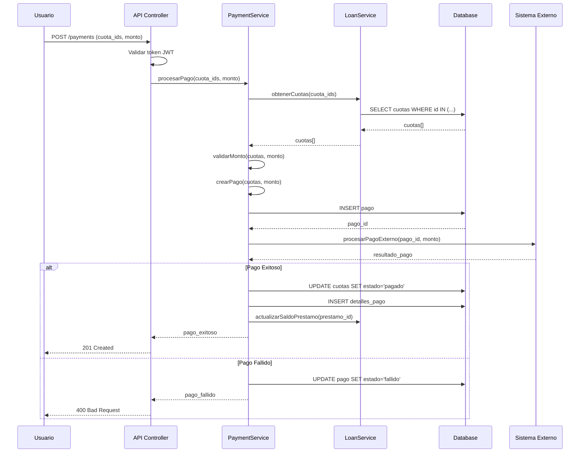

## 🔄 Diagrama de Secuencia - Generación de Sugerencias

### Proceso de Sugerencias Inteligentes

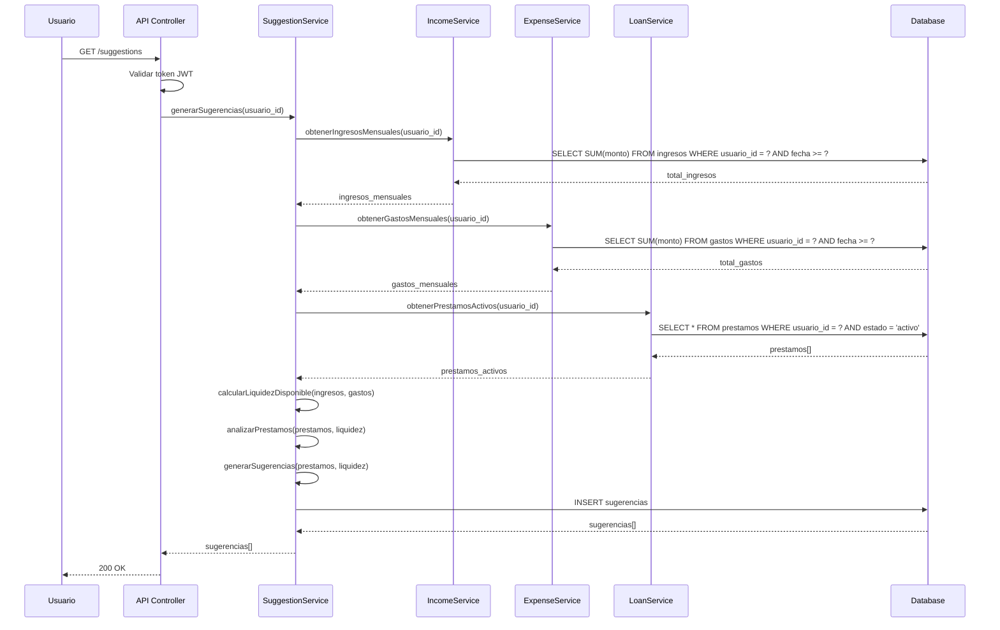

## 🏗️ Diagrama de Componentes

### Arquitectura de Componentes

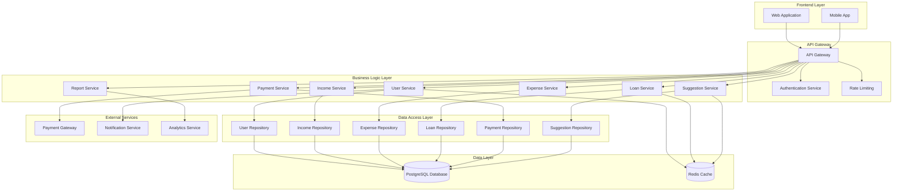

## 🎯 Diagrama de Casos de Uso Detallado

### Casos de Uso del Usuario Final

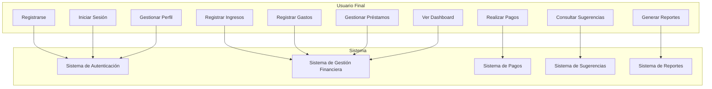

## 🔧 Diagrama de Clases - Servicios

### Capa de Servicios

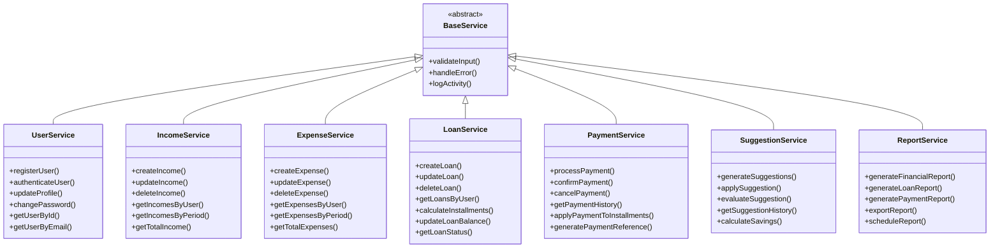

## 🗄️ Diagrama de Clases - Repositorios

### Patrón Repository

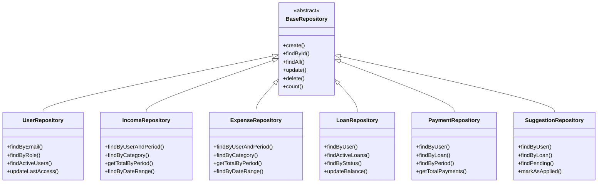

## 🔐 Diagrama de Clases - Seguridad

### Sistema de Autenticación y Autorización

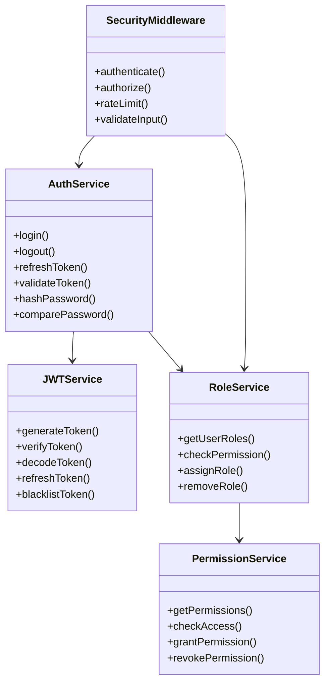

## 📊 Diagrama de Estados - Préstamo

### Estados del Préstamo

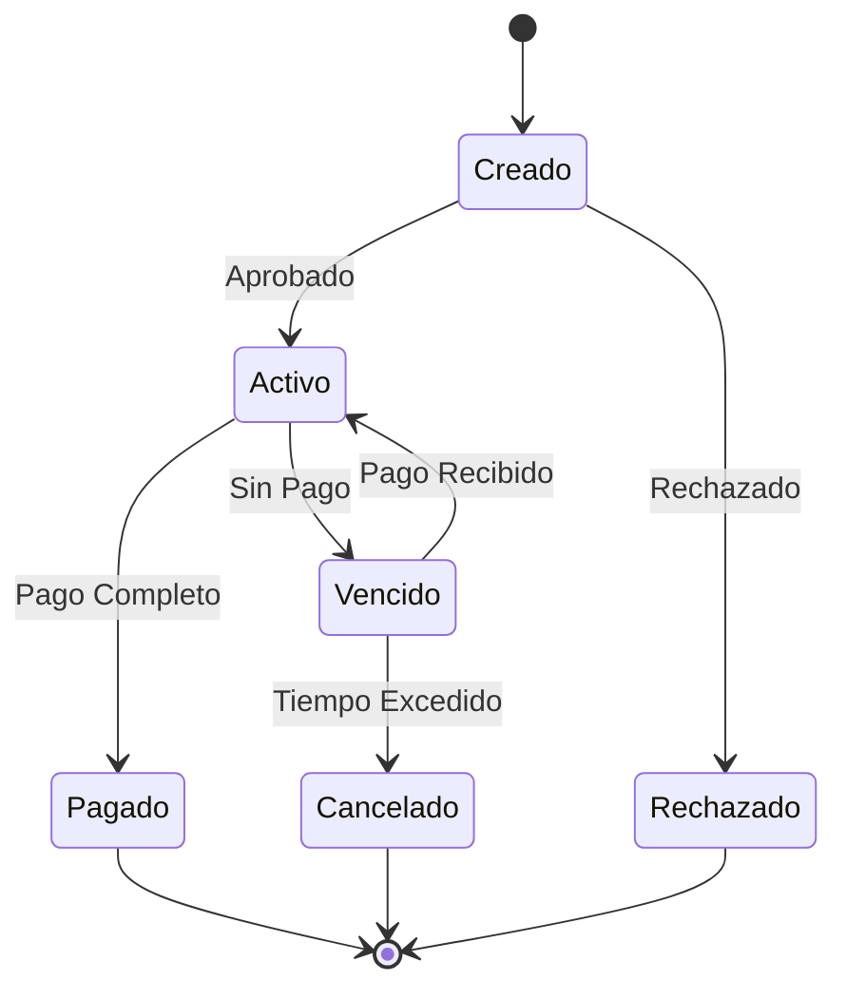

## 📊 Diagrama de Estados - Pago

### Estados del Pago

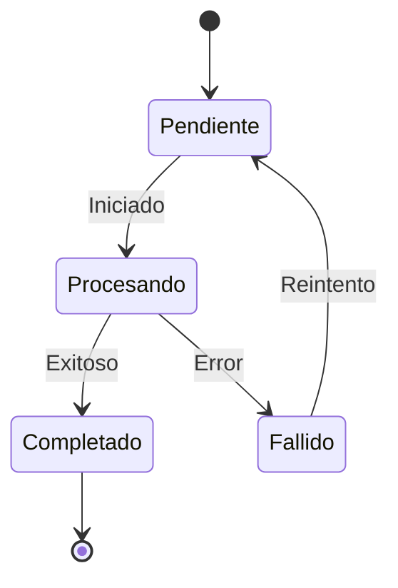

## 🔄 Diagrama de Actividad - Flujo de Sugerencias

### Proceso de Generación de Sugerencias

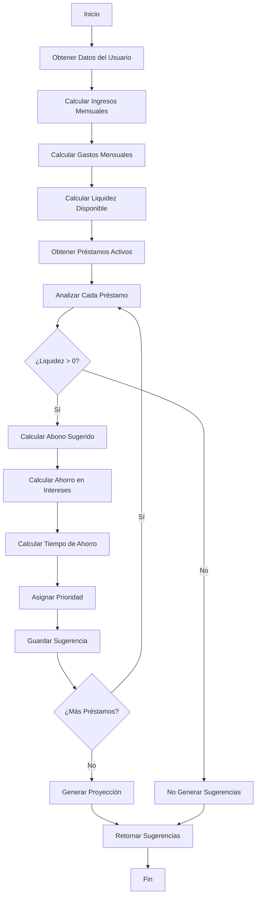

## 🏗️ Diagrama de Paquetes

### Organización del Código

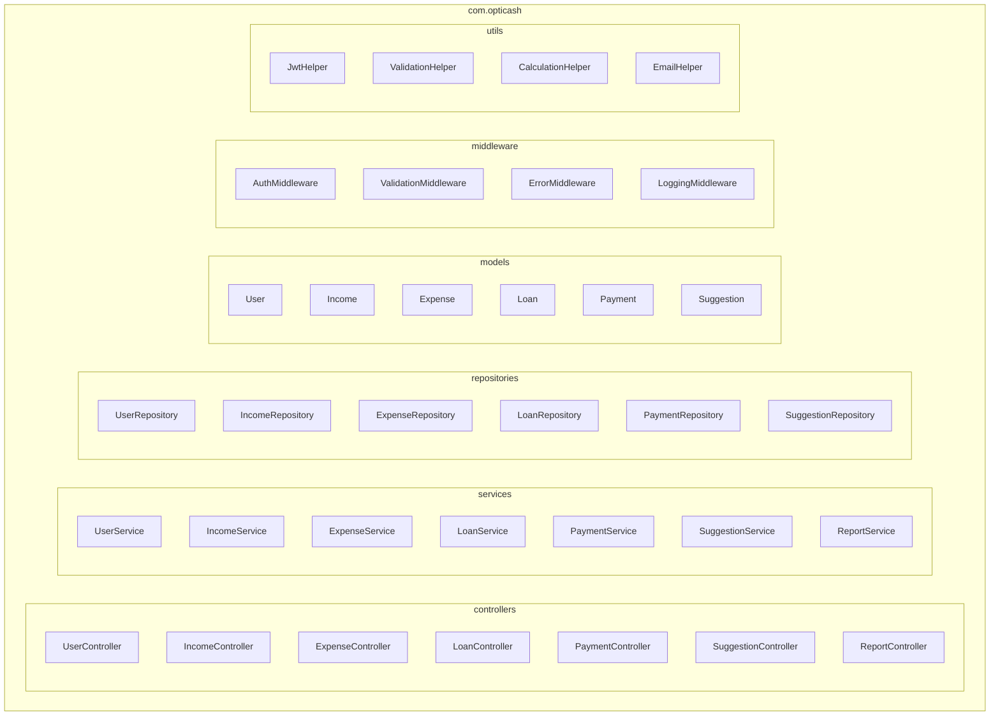

## ✅ Criterios de Aceptación

### Diagramas de Clases
- ✅ Representación clara de todas las entidades del dominio
- ✅ Relaciones bien definidas entre clases
- ✅ Atributos y métodos especificados
- ✅ Patrones de diseño identificados

### Diagramas de Secuencia
- ✅ Flujos de interacción detallados
- ✅ Participantes claramente identificados
- ✅ Mensajes bien definidos
- ✅ Alternativas y excepciones consideradas

### Diagramas de Componentes
- ✅ Arquitectura de capas representada
- ✅ Responsabilidades bien definidas
- ✅ Acoplamiento y cohesión apropiados
- ✅ Escalabilidad considerada

### Diagramas de Estados
- ✅ Estados del sistema identificados
- ✅ Transiciones claramente definidas
- ✅ Eventos que disparan cambios
- ✅ Estados finales especificados

---

**Diagramas UML OptiCash** - Versión 1.0
