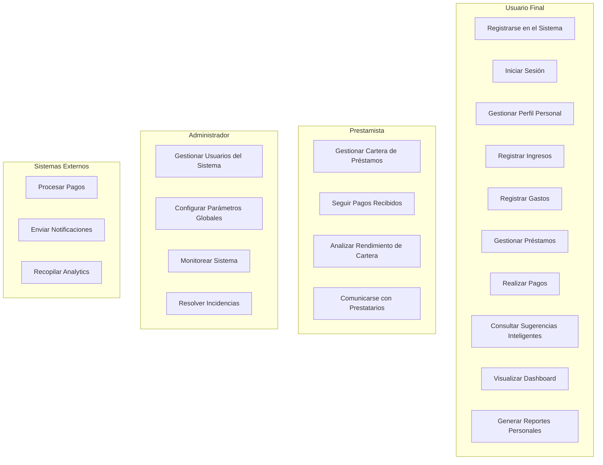
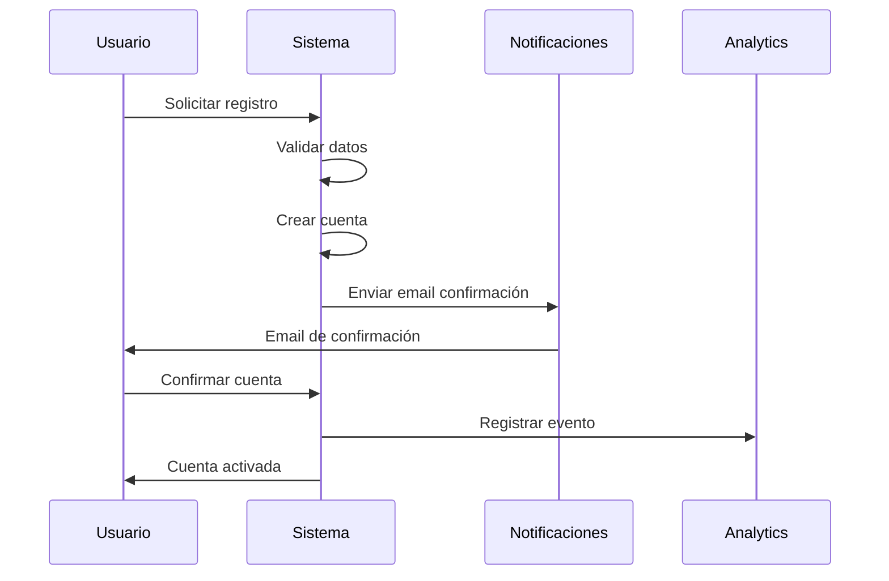
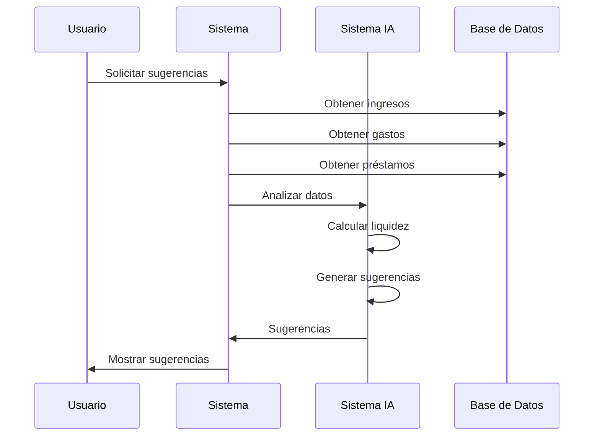

# OptiCash - Casos de Uso Principales

## 📋 Resumen

Este documento describe los casos de uso principales del sistema OptiCash, un gestor financiero personal inteligente. Incluye diagramas de casos de uso, especificaciones detalladas y flujos de interacción.

## 🎯 Diagrama General de Casos de Uso

## 📝 Casos de Uso Detallados

### UC-001: Registrarse en el Sistema
**Actor Principal:** Usuario Final
**Actor Secundario:** Sistema de Notificaciones

**Descripción:** Un nuevo usuario se registra en el sistema OptiCash para comenzar a gestionar sus finanzas personales.

**Precondiciones:**
- El usuario no tiene cuenta en el sistema
- El sistema está disponible

**Flujo Principal:**
1. El usuario accede a la página de registro
2. El usuario ingresa sus datos personales (nombre, email, contraseña)
3. El sistema valida los datos ingresados
4. El sistema verifica que el email no esté registrado
5. El sistema crea la cuenta del usuario
6. El sistema envía email de confirmación
7. El usuario confirma su cuenta
8. El sistema activa la cuenta del usuario

**Flujo Alternativo 4a:** Email ya registrado
4a. El sistema muestra mensaje de error
4a. El usuario ingresa un email diferente
4a. Continúa en el paso 3

**Postcondiciones:**
- El usuario tiene una cuenta activa en el sistema
- El usuario puede iniciar sesión

**Criterios de Aceptación:**
- Validación de formato de email
- Contraseña con mínimo 8 caracteres
- Email único en el sistema
- Confirmación por email

---

### UC-002: Iniciar Sesión
**Actor Principal:** Usuario Final
**Actor Secundario:** Sistema de Analytics

**Descripción:** Un usuario registrado inicia sesión en el sistema para acceder a sus funcionalidades.

**Precondiciones:**
- El usuario tiene una cuenta activa
- El usuario conoce sus credenciales

**Flujo Principal:**
1. El usuario accede a la página de login
2. El usuario ingresa su email y contraseña
3. El sistema valida las credenciales
4. El sistema genera token JWT
5. El sistema registra el evento de login
6. El sistema redirige al dashboard

**Flujo Alternativo 3a:** Credenciales inválidas
3a. El sistema muestra mensaje de error
3a. El usuario reintenta o recupera contraseña
3a. Continúa en el paso 2

**Postcondiciones:**
- El usuario está autenticado
- El usuario puede acceder a sus funcionalidades

**Criterios de Aceptación:**
- Autenticación exitosa con credenciales válidas
- Generación de token JWT
- Registro de evento de login
- Redirección al dashboard

---

### UC-003: Registrar Ingresos
**Actor Principal:** Usuario Final
**Actor Secundario:** Sistema de Analytics

**Descripción:** Un usuario registra sus ingresos para mantener un historial detallado de sus movimientos financieros.

**Precondiciones:**
- El usuario está autenticado
- El usuario tiene acceso a la funcionalidad

**Flujo Principal:**
1. El usuario accede a la sección de ingresos
2. El usuario selecciona "Nuevo Ingreso"
3. El usuario ingresa los datos del ingreso (monto, descripción, categoría, fecha)
4. El sistema valida los datos ingresados
5. El sistema guarda el ingreso en la base de datos
6. El sistema actualiza el dashboard del usuario
7. El sistema registra el evento para analytics

**Flujo Alternativo 4a:** Datos inválidos
4a. El sistema muestra mensajes de error específicos
4a. El usuario corrige los datos
4a. Continúa en el paso 4

**Postcondiciones:**
- El ingreso está registrado en el sistema
- El dashboard muestra la información actualizada

**Criterios de Aceptación:**
- Validación de monto positivo
- Categorización correcta
- Fecha válida
- Actualización en tiempo real

---

### UC-004: Registrar Gastos
**Actor Principal:** Usuario Final
**Actor Secundario:** Sistema de Analytics

**Descripción:** Un usuario registra sus gastos para mantener un control detallado de sus movimientos financieros.

**Precondiciones:**
- El usuario está autenticado
- El usuario tiene acceso a la funcionalidad

**Flujo Principal:**
1. El usuario accede a la sección de gastos
2. El usuario selecciona "Nuevo Gasto"
3. El usuario ingresa los datos del gasto (monto, descripción, categoría, fecha)
4. El sistema valida los datos ingresados
5. El sistema guarda el gasto en la base de datos
6. El sistema actualiza el dashboard del usuario
7. El sistema registra el evento para analytics

**Flujo Alternativo 4a:** Datos inválidos
4a. El sistema muestra mensajes de error específicos
4a. El usuario corrige los datos
4a. Continúa en el paso 4

**Postcondiciones:**
- El gasto está registrado en el sistema
- El dashboard muestra la información actualizada

**Criterios de Aceptación:**
- Validación de monto positivo
- Categorización correcta
- Fecha válida
- Actualización en tiempo real

---

### UC-005: Gestionar Préstamos
**Actor Principal:** Usuario Final
**Actor Secundario:** Sistema de Notificaciones

**Descripción:** Un usuario gestiona sus préstamos personales, incluyendo registro, consulta y seguimiento.

**Precondiciones:**
- El usuario está autenticado
- El usuario tiene acceso a la funcionalidad

**Flujo Principal:**
1. El usuario accede a la sección de préstamos
2. El usuario selecciona "Nuevo Préstamo"
3. El usuario ingresa los datos del préstamo (monto, plazo, tipo, tasa de interés)
4. El sistema valida los datos ingresados
5. El sistema calcula las cuotas del préstamo
6. El sistema guarda el préstamo en la base de datos
7. El sistema genera las cuotas automáticamente
8. El sistema envía notificación de confirmación

**Flujo Alternativo 4a:** Datos inválidos
4a. El sistema muestra mensajes de error específicos
4a. El usuario corrige los datos
4a. Continúa en el paso 4

**Postcondiciones:**
- El préstamo está registrado en el sistema
- Las cuotas están generadas automáticamente
- El usuario recibe confirmación

**Criterios de Aceptación:**
- Validación de monto y plazo
- Cálculo correcto de cuotas
- Generación automática de cuotas
- Notificación de confirmación

---

### UC-006: Realizar Pagos
**Actor Principal:** Usuario Final
**Actor Secundario:** Sistema de Pagos, Sistema de Notificaciones

**Descripción:** Un usuario realiza pagos de sus préstamos, incluyendo cuotas regulares y abonos a capital.

**Precondiciones:**
- El usuario está autenticado
- El usuario tiene préstamos activos
- El usuario tiene cuotas pendientes

**Flujo Principal:**
1. El usuario accede a la sección de pagos
2. El usuario selecciona el préstamo a pagar
3. El usuario ingresa el monto a pagar
4. El usuario selecciona el método de pago
5. El sistema valida el monto y método de pago
6. El sistema procesa el pago a través del gateway
7. El sistema aplica el pago a las cuotas correspondientes
8. El sistema actualiza los saldos
9. El sistema envía confirmación de pago

**Flujo Alternativo 6a:** Pago fallido
6a. El sistema muestra mensaje de error
6a. El usuario reintenta con otro método
6a. Continúa en el paso 4

**Postcondiciones:**
- El pago está procesado
- Las cuotas están actualizadas
- El usuario recibe confirmación

**Criterios de Aceptación:**
- Validación de monto y método
- Procesamiento exitoso del pago
- Aplicación correcta a cuotas
- Confirmación de pago

---

### UC-007: Consultar Sugerencias Inteligentes
**Actor Principal:** Usuario Final
**Actor Secundario:** Sistema de IA

**Descripción:** Un usuario consulta sugerencias inteligentes para optimizar sus abonos a capital.

**Precondiciones:**
- El usuario está autenticado
- El usuario tiene préstamos activos
- El usuario tiene ingresos y gastos registrados

**Flujo Principal:**
1. El usuario accede a la sección de sugerencias
2. El sistema analiza los ingresos del usuario
3. El sistema analiza los gastos del usuario
4. El sistema calcula la liquidez disponible
5. El sistema analiza los préstamos activos
6. El sistema genera sugerencias de abono
7. El sistema presenta las sugerencias al usuario
8. El usuario puede aplicar las sugerencias

**Flujo Alternativo 7a:** No hay liquidez suficiente
7a. El sistema sugiere optimización de gastos
7a. El sistema propone estrategias de ahorro
7a. Continúa en el paso 8

**Postcondiciones:**
- El usuario recibe sugerencias personalizadas
- El usuario puede aplicar las sugerencias

**Criterios de Aceptación:**
- Análisis preciso de ingresos y gastos
- Cálculo correcto de liquidez
- Sugerencias relevantes y útiles
- Aplicación fácil de sugerencias

---

### UC-008: Gestionar Cartera de Préstamos (Prestamista)
**Actor Principal:** Prestamista
**Actor Secundario:** Sistema de Analytics

**Descripción:** Un prestamista gestiona su cartera de préstamos otorgados.

**Precondiciones:**
- El prestamista está autenticado
- El prestamista tiene préstamos otorgados

**Flujo Principal:**
1. El prestamista accede al dashboard de cartera
2. El prestamista visualiza sus préstamos activos
3. El prestamista puede filtrar por estado, fecha, monto
4. El prestamista puede ver detalles de cada préstamo
5. El prestamista puede generar reportes de cartera
6. El prestamista puede exportar datos

**Postcondiciones:**
- El prestamista tiene visibilidad completa de su cartera
- El prestamista puede tomar decisiones informadas

**Criterios de Aceptación:**
- Visualización clara de préstamos
- Filtros y búsquedas funcionales
- Reportes detallados
- Exportación de datos

---

### UC-009: Gestionar Usuarios del Sistema (Administrador)
**Actor Principal:** Administrador
**Actor Secundario:** Sistema de Notificaciones

**Descripción:** Un administrador gestiona los usuarios del sistema.

**Precondiciones:**
- El administrador está autenticado
- El administrador tiene permisos administrativos

**Flujo Principal:**
1. El administrador accede al panel administrativo
2. El administrador visualiza la lista de usuarios
3. El administrador puede crear nuevos usuarios
4. El administrador puede editar usuarios existentes
5. El administrador puede desactivar usuarios
6. El administrador puede asignar roles

**Postcondiciones:**
- Los usuarios están gestionados correctamente
- Los roles están asignados apropiadamente

**Criterios de Aceptación:**
- Gestión completa de usuarios
- Asignación correcta de roles
- Auditoría de cambios
- Notificaciones apropiadas

---

### UC-010: Procesar Pagos (Sistema Externo)
**Actor Principal:** Sistema de Pagos
**Actor Secundario:** Usuario Final

**Descripción:** El sistema de pagos procesa las transacciones financieras.

**Precondiciones:**
- El usuario está autenticado
- El usuario tiene un método de pago válido

**Flujo Principal:**
1. El sistema recibe la solicitud de pago
2. El sistema valida el método de pago
3. El sistema procesa la transacción
4. El sistema confirma el pago
5. El sistema actualiza los saldos
6. El sistema genera comprobante

**Postcondiciones:**
- El pago está procesado exitosamente
- El usuario recibe confirmación

**Criterios de Aceptación:**
- Procesamiento seguro de pagos
- Confirmación inmediata
- Actualización de saldos
- Generación de comprobantes

## 📊 Matriz de Casos de Uso por Actor

| Caso de Uso | Usuario Final | Prestamista | Administrador | Sistema Externo |
|--------------|---------------|-------------|---------------|-----------------|
| UC-001: Registrarse | ✅ | ✅ | ❌ | ❌ |
| UC-002: Iniciar Sesión | ✅ | ✅ | ✅ | ❌ |
| UC-003: Registrar Ingresos | ✅ | ❌ | ❌ | ❌ |
| UC-004: Registrar Gastos | ✅ | ❌ | ❌ | ❌ |
| UC-005: Gestionar Préstamos | ✅ | ✅ | ❌ | ❌ |
| UC-006: Realizar Pagos | ✅ | ❌ | ❌ | ✅ |
| UC-007: Sugerencias Inteligentes | ✅ | ❌ | ❌ | ❌ |
| UC-008: Gestionar Cartera | ❌ | ✅ | ❌ | ❌ |
| UC-009: Gestionar Usuarios | ❌ | ❌ | ✅ | ❌ |
| UC-010: Procesar Pagos | ❌ | ❌ | ❌ | ✅ |

## 🔄 Flujos de Interacción Detallados

### Flujo de Registro y Onboarding

### Flujo de Sugerencias Inteligentes

## 📋 Criterios de Aceptación Generales

### Funcionalidad
- ✅ Todos los casos de uso operan según especificación
- ✅ Flujos principales y alternativos funcionan correctamente
- ✅ Validaciones son apropiadas y claras
- ✅ Postcondiciones se cumplen consistentemente

### Usabilidad
- ✅ Interfaz intuitiva para cada caso de uso
- ✅ Mensajes de error claros y útiles
- ✅ Navegación fluida entre funcionalidades
- ✅ Feedback inmediato a acciones del usuario

### Seguridad
- ✅ Autenticación requerida donde corresponde
- ✅ Autorización apropiada por rol
- ✅ Validación de datos de entrada
- ✅ Auditoría de acciones críticas

### Rendimiento
- ✅ Tiempo de respuesta < 2 segundos
- ✅ Procesamiento de sugerencias < 3 segundos
- ✅ Actualizaciones en tiempo real
- ✅ Manejo de concurrencia

---

**Casos de Uso OptiCash** - Versión 1.0
